## 2

## Medication List

Successful medication management is a key part of a patient’s health care

* * *

Medication lists record information about all the drugs a patient is currently receiving and their prescribed dosages. Medication lists come in many forms, but this chapter will only focus on three:**simple lists**,**interactive lists**, and**medication timelines**. We’ll offer a few tips and challenges along the way.

Gallery 2.1

*   

2.1 a Simple List— Helps physicians with a variety of tasks, such as making treatment decisions or e-prescribing.
[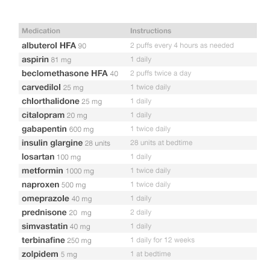](./images/SimpleList_ReduceNoise.png "Gallery 2.1 a - Simple List - Helps physicians with a variety of tasks, such as making treatment decisions or e-prescribing.")

*   

2.1 b Simple List— Also ideal for mobile which patients can access easily.
[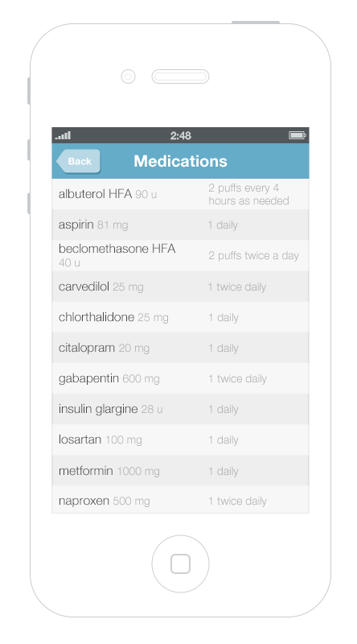](./images/SimpleListMobile.png "Gallery 2.1 b - Simple List - Also ideal for mobile which patients can access easily")

*   

2.1 c Interactive List— Contains more details about the medications and helps physicians with tasks such as making treatment decisions or e-prescribing
[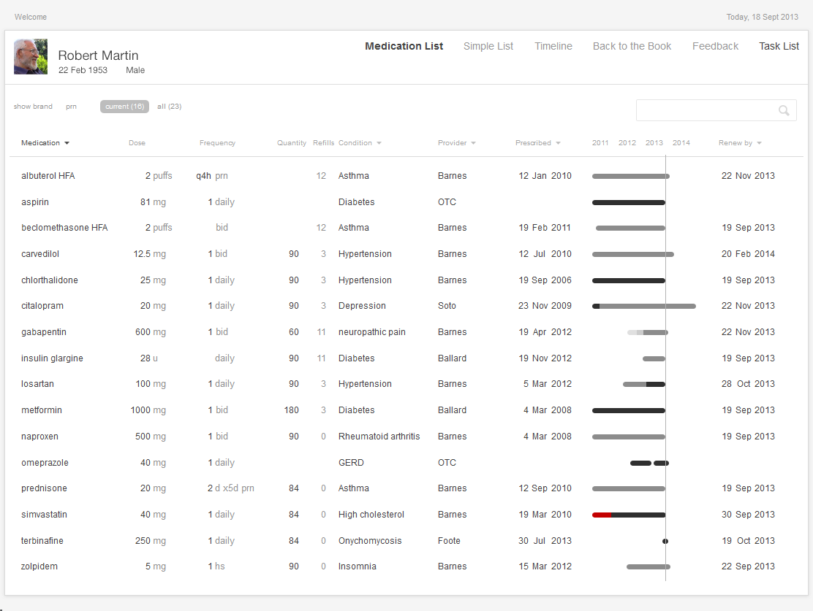](./images/UM_EHR_0000_table.png "Gallery 2.1 c - Interactive List - Contains more details about the medications and helps physicians with tasks such as making treatment decisions or e-prescribing.")

*   

2.1 d Medication Timeline— Harnesses the power of information visualization and allows physicians to understand changes in medications over time.

* * *

### 2.1[The Simple List](http://inspiredehrs.org/simple-list/)

The simple list displays bare-bones basic information. It’s made to be read quickly, scanned at a glance. It’s easy to scan visually to see the name, strength, and dosing of the medication. The list is alphabetical, which makes it easy to search for and locate particular items. It gives the user, usually a physician, a broad overview of the patient’s medical history and their related medications. A physician quickly scanning the simple list can make initial observations such as,_“There are twenty-four medications here, but only two prescription medications for high blood pressure.”_ Good design can make such tasks easy; bad design can make them much harder.

We use the term “patient” to apply to either patients themselves, caregivers, or family members acting on their behalf. Similarly, we use the term “physician” to apply to physicians proper or other healthcare professionals with prescribing authority.

#### A Common Scenario — Going into the Exam Room

Dr. Barnes, a general internist is about to go into the exam room to see her patient Mr. Martin, a 60-year-old man with ten chronic diseases (diabetes, high blood pressure, high cholesterol, knee arthritis, depression, insomnia, etc.) who is taking seventeen medications. The physician notes that the patient’s blood pressure is about ten points too high. She plans to ask the patient if he has been taking his blood pressure at home and what the results of any such tests have been.

In this scenario, the physician needs to have an overall awareness of the patient’s medications, chronic problems, latest vital signs, and relevant lab test results fresh in her mind when the face-to-face visit begins. (“Is he taking insulin? Is he on any high-risk drugs like warfarin?”) Armed with this background, the physician is able to give her full attention to the patient telling his story, and she won’t have to keep glancing away from him and back at the EHR to be reminded of the medications. Giving full attention to his story shows the patient that she’s listening to and cares about what he has to say. Establishing context will allow our physician to attend to the practicalities and the emotional tone of this encounter, and to frame this visit in relation to a bigger picture that includes the patient's past and current data, his story.

#### Situational Awareness

Situational awareness is having all the background information you need to make effective decisions while simultaneously...<a class="a">Read more</a>

Situational awareness is having all the background information you need to make effective decisions while simultaneously being aware of what is currently happening around you and anticipating what will happen in the near future. For physicians managing chronic diseases during ambulatory visits, situational awareness consists of taking in a broad overview of key information about patients before walking into the exam room. Upon entering the exam room, the physician can then be mindful of and attuned to the patient sitting before them and the unfolding of their conversation.

If Dr. Barnes enters the exam room half-prepared due to time pressure or information chaos, then she’ll struggle to listen to the patient’s concerns.[Information chaos](./human-factors.php#info_chaos) (See Information Chaos in the Human Factors chapter) comprises information overload, underload, scatter, conflict, and erroneous information. Instead, she’ll search through the EHR while the patient speaks, frantically trying to fill the gaps in her knowledge. The patient will sense the physician’s distraction, and may feel that he’s not being heard, that he is being left out of decisions that concern his body and wellbeing. The physician may miss something important, telling details about what the patient says because she is distracted.

Look at[Figure 2.1](#fig-2-1) and[ Figure 2.2](#fig-2-2). As you can probably tell, one list looks cleaner than the other. Such simplicity makes it easy for people using this list to see the names of the drugs the patient is taking, which allows a quick overview. Given that it uses plain language like “twice daily,” instead of Latin abbreviations like “b.i.d.,” the list below would meet the needs of both physicians and patients.

Figure 2.1Before: An Awful Medication List  

[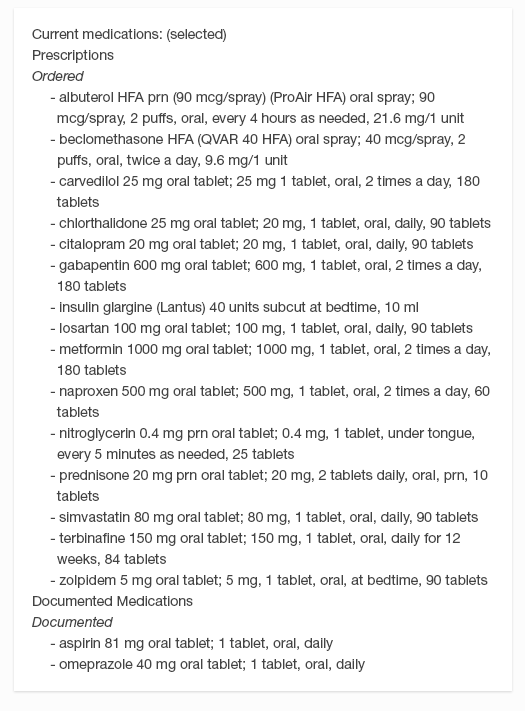](./images/EHR_SimpleList_Before.png "Figure 2.1 - Before: An Awful Medication List")

Figure 2.2After: Simple Medication List Makeover
[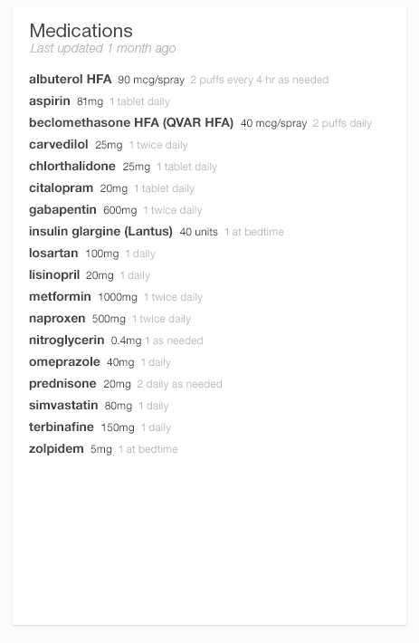](./images/EHR_SimpleList_After.png "Figure 2.2 - After: Simple Medication List Makeover")

Patients can also use this list. Patients can easily show this list to other physicians, dentists, emergency room staff, or their caregivers. Patients filling up weekly medication reminder boxes might, however, need a more detailed list —perhaps one that illustrates the contents of each compartment of their box, and more clearly differentiates the time of day at which they should take each dose of medication.

A physician or nurse would expect a progress note from a previous visit, a dashboard overview, or a visit summary from an outside EHR to make use of this simple format. It’s a quick snapshot, intended to be taken in at a glance. A physician doing a more complex task, like e-prescribing, might prefer an interactive display with more information, such as the interactive table or the medication timeline.

In this context, the physician just needs to quickly see the medications’ names. Avoid the temptation to add extraneous detail here. Concise lists are easier to read. Physicians don’t need to see the medications’ quantities, start dates, or the number of refills in a given prescription to perform this task. If the list uses a brand name, be sure to include the product’s generic name as well. Dealing with brand, generic, and compound names can be a challenge (see the following note).

#### Challenge: Handling Brand and Generic Names

This can get tricky. We’ll admit right now: there may not be one correct answer to the problem of whether to show the brand name...Read more

This can get tricky. We’ll admit right now: there may not be one correct answer to the problem of whether to show the brand name, the generic name, or both names by default in medication lists. It depends on the context, and the people in the conversation. The EHR can offer easy access to both the generic and the brand names of all relevant drugs. But several factors complicate the question of the form this access could take.

Here are a few considerations.

Ideally, both names would be available on demand at just the right time. Sometimes it may be appropriate to display both generic and brand name —for example “furosemide (Lasix) 20 mg.” For consistency, sort alphabetically by the generic name. But if you’re working with a printed list, then you might have to choose a single method of display. People often prefer to use brand names in conversation because the generic names may be difficult to remember or pronounce, even for for physicians. Say these three times fast:

*   adalimumab — Humira
*   ondansetron — Zofran
*   furosemide — Lasix

The problems are compounded by the fact that some medications have many confusing non-interchangeable brand names. Diltiazem, for example, may be available as:

*   Cardizem
*   Cardizem LA
*   Cardizem CD
*   Cartia XT
*   Dilacor XR
*   etc., etc.

When discussing medications with patients, physicians need to be aware of the name of the drug as the patients know it. Patients may be more familiar with a particular version of a drug’s name because it is what is written on the medication container dispensed by their pharmacy, or because that version of the name is easier to recall or pronounce. When speaking with patients, physicians might find it helpful to refer to drugs by both names (“Your furosemide, also called Lasix”). Having both names displayed, especially for less common drugs may decrease mental effort.

We can make medication lists easier to read by**emphasizing** the names of drugs andde-emphasizing everything else. Physician’s eyes need to notice the names and strengths more than they need to take in the whole line of text. Dosage instructions such as “take 1 tablet daily,” while important in some contexts, are secondary pieces of information. One method of denoting that these instructions are of secondary importance is to use gray text. The difference between this gray text and the rest won’t be extreme, and thus won’t be visually jarring, but it**will** be immediately apparent to the human brain’s[visual processing system (See How People Perceive in the Human Factors chapter)](./human-factors.php#how-people-perceive). Compared with this light gray text, the black medicine names will possess the “[preattentive attributes](./human-factors.php#preattentive-attributes)" (See Preattentive Attributes in the Human Factors chapter) our brains readily detect and flag as important.

Gallery 2.2Making Added Emphasis to Text Just Right

*   

2.2 a Too jarring

    lisinopril 20 mg 1 tablet daily

    

*   

2.2 b Too subtle

    lisinopril 20 mg1 tablet daily

    

*   

2.2 c Invisible to color-blind users

    lisinopril 20 mg 1 tablet daily

    

*   

2.2 d Just right

    **lisinopril 20 mg**1 tablet daily

    

On the other hand, sometimes a[deliberately jarring](./design-principles.php#dark-side-of-color) (See The Dark Side of Seeing Color in the Design Principles chapter) type style alerts the user to pay attention. Some EHRs use**tall man lettering** to differentiate look-alike and/or sound-alike drug names that might otherwise be easily (and dangerously) confused. Tall man lettering capitalizes the parts of a word that separate it from its near-doppelgangers: hydrALAzine vs. hydrOXYzine. This unusual, seemingly “incorrect” capitalization says to the user, “Hey, pay attention here, the part I’ve emphasized is really important.” HydrALAzine is a blood pressure medication, hydrOXYzine is an antihistamine. Small differences matter.

#### Preattentive Attributes

Preattentive attributes are the little visual things people unconsciously notice and understand quickly, so quickly that we have only...Read more

Preattentive attributes are the little visual things people unconsciously notice and understand quickly, so quickly that we have only noticed it at an unconscious level. Try this little exercise, which can help you understand what sort of things we’re talking about.

**How many fives do you find in each rectangle below?**

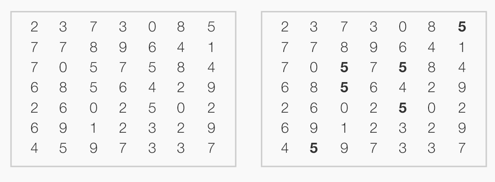

It’s much easier to spot the fives in the right-hand figure because our brain perceives the bold characters without our conscious volition.

When processing visual information, our brains combine very basic attributes (shape, size, orientation, motion) into “objects” that have some meaning to us (face, pole, box). This happens very quickly, below the level of our conscious awareness. Some features stand out more readily and are noticed more quickly than others. Those features are called[preattentive attributes](./human-factors.php#preattentive-attributes) (See Preattentive Attributes in the Human Factors chapter).

Alphabetize the list. Readers expect a list of text items to be alphabetical. This helps them find particular names quickly in long lists. “Are they taking warfarin?” Just jump to the “w” section to check.

Reduce visual noise. If a visual element doesn’t add data or improve the perception or processing of information, try leaving it out. See[ Figures 2.3](#fig-2-3) and[2.4](#fig-2-4).

Figure 2.3Before: The Frame Creates Visual Noise
[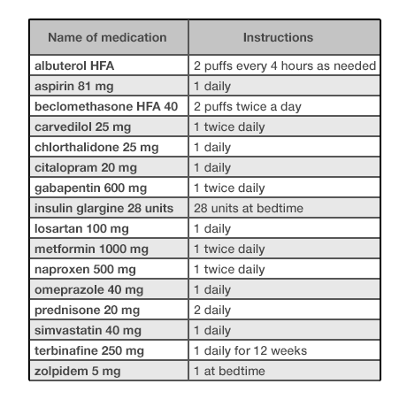](./images/SimpleList_Noisy.png "Figure 2.3 - Before: The Frame Creates Visual Noise")

Figure 2.4After: Cleaner, Data Takes Center Stage

Borders don’t add information, and removing gridlines can make your data less visually noisy (and thus easier to read).

Now, let’s move on to the interactive table.

* * *

### 2.2[The Interactive Table](../medication-list/)

The interactive table allows users to sort, filter, and otherwise adjust their displays to meet the needs of the tasks at hand. This table is the standard workhorse of an EHR, and may sometimes be the only view available. The table is sufficiently flexible and powerful to adapt to fit a variety of tasks, but it can also be complex and may require more effort to learn and use than a simple list. Interactive lists help with a variety of tasks, such as making treatment decisions or e-prescribing. The list might even be able to draw on other data stored in the EHR, such as diagnoses, lab values or vital signs. Of our three examples, this list displays the most information and can provide the best support for cognitively intense tasks.

[Interactive 2.1](#int-2-1) shows an example of an Interactive Table. By default, such tables are sorted alphabetically by medication name. Physicians can sort columns of data to gain new insight into the medications and have support for various functions of medication renewals. Not all columns need to be sorted, however. For example, a physician would not find it helpful to sort by the instructions or quantity prescribed, but would find it useful to sort the list by drug names (allowing the physician to scan alphabetically, looking for a specific name), by dates (starting, renewal due, etc), diagnoses, and prescriber names.

Interactive 2.1Interactive Table Prototype —[Try it out!](../medication-list/)

Try it out:<a>InspiredEHRs.org/medication-list/</a>

Download the code:<a>github/goinvo/ehr</a>

#### Returning to the Clinical Scenario — Blood Pressure (BP) Too High

Upon entering the room, Dr. Barnes learns that Mr. Martin has been exercising regularly and eating a healthy diet. He is on seventeen medications. He is tolerating them well, and taking them consistently. His blood pressure is about 10 points too high today, however, and it has been similarly elevated when he measured it at home. Dr. Barnes wants to adjust his blood pressure medications to achieve better control.

Dr. Barnes turns to the interactive medication list and sorts the medications by diagnosis. She can readily see that the patient is already on three medications for blood pressure. With some effort, she determines that all three medications are at their maximum dose. The patient will have to begin taking an additional blood pressure medication. She thinks prescribing lisinopril is the obvious next step, but given that this decision does seem so obvious, our physician wonders if there’s some hidden reason why the patient isn’t on lisinopril already.

Here’s the mental task for our physician (see[Figure 2.5](#fig-2-5)):

*   Review the medication list.
*   Identify medications for treating high BP (antihypertensives) that the patient is taking.
*   Determine if the patient is already taking the maximum dose of each of these medications.
    *   If one or more of the current medications is not at the maximum dose, consider whether that medication’s dosage could be increased (this may be preferable because it won’t cost the patient a new co-pay, increase their potential drug interactions, or increase the number of pills the patient has to take).
    *   If all the BP meds are at their maximum dose, then the physician must select an additional medication and add it to the treatment plan.

Juggling these considerations can be a lot of mental work. Fortunately, you can make the job much easier.

Figure 2.5The[Cognitive Load](./human-factors.php#cognitive-load) (See Cognitive Load in the Human Factors chapter) on Physicians Adjusting Blood Pressure Medications
[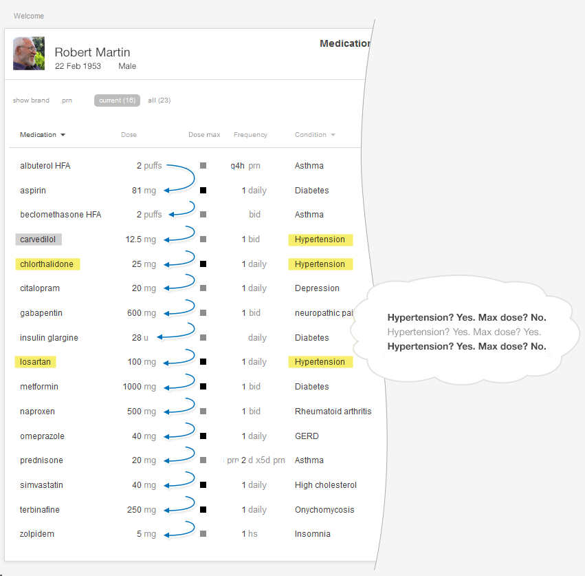](./images/UM_EHR_0006_mental-work.png "Figure 2.5 - The cognitive load on physicians adjusting blood pressure medications")

You can reduce the risk of error (missing one medication in the list) and decrease required mental effort ([cognitive load](./human-factors.php#cognitive-load)) (See Cognitive Load in the Human Factors chapter) by using smart design features.

We have several suggestions for improving medication lists. Follow[Effective Table Design guidelines](https://sbmi.uth.edu/dotAsset/3fc9f186-7608-4b57-9ade-64a90e5916e0.pdf) (http://tinyurl.com/puxl2y3). For example, make sure table headers remain visible all the time and don’t scroll out of view. The most important columns can be on the left (in this case, drug names). Make sure long names (like those of compound drugs) don’t get truncated without leaving some visual indication that this is what happened, and make sure the entire names are quickly accessible. You can read more about table design at the[SHARP-C website](https://sbmi.uth.edu/nccd/index.htm).

**Allow users to sort the medication list by associated diagnosis.** Humans’ limited working memory can only hold three to four compound and complex items, like medications with associated strengths and daily dosing instructions, at a given time.

#### Working Memory

Working memory, or short term memory, enables us to recall manageable chunks of information...Read more

Working memory, or short term memory, enables us to recall manageable chunks of information —say phone numbers we’re in the process of writing down or punching into our phones —that we need for less than a minute. We have to focus on something to keep it in our short term memory.

Asking people to look at information on one page and then remember it and use it on another page strains their short term memory. When designing interfaces, keep this in mind. Ask yourself if you can present information in a way that will allow users to focus on remembering the elements of their own tasks, rather than on engaging with your system. Try to avoid having the user get information on one page and then needing to remember it in order to use it on another page.

[Read more on Working Memory in the Human Factors chapter.](./human-factors.php#working-memory)

Sorting by diagnosis is only possible when previous physicians or providers have entered the information about the diagnoses that prompted a patient’s prescriptions. Currently physicians aren’t required to always give this information, and many don't because they don't see an obvious benefit to doing so. However with an EHR that effectively sorts by diagnoses, entering this information once for each medication will prevent a lot of unnecessary mental work in the future. When a physician prescribes a new medication, the system will present a list of the patient's current diagnoses or chronic problems. The physician can merely pick one or more of these from this list as applicable, or add a new diagnosis or chronic problem. This is essentially the same work physicians already have to do when sending out lab and imaging orders.

Sorting by diagnosis does, however, present designers and developers with additional challenges. Sorting medications that are associated with more than one diagnosis will be a design challenge. How might they represent medications associated with multiple diagnoses? How might an EHR deal with different providers' ontologies for diagnoses in the context of a health information exchange? A family physician might describe a condition as "chronic low back pain," while the orthopedic surgeon might call the same problem "lumbar spondylosis."

Gallery 2.3Easing Mental Work— How many current medications for hypertension? Which medication was previously used for hypertension?

*   

2.3 a Sorted by Condition
[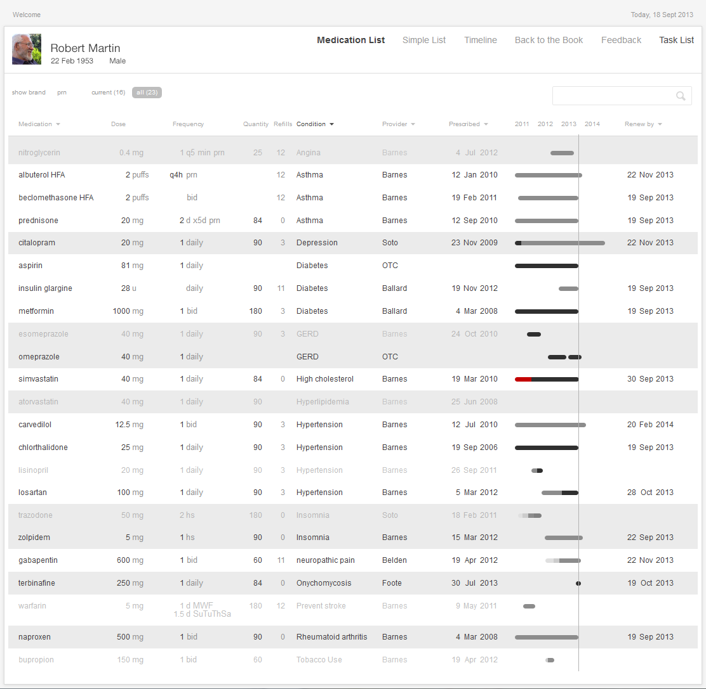](./images/UM_EHR_0001_sort-condition.png "Sorted by Condition")

*   

2.3 b Filtered by Condition
[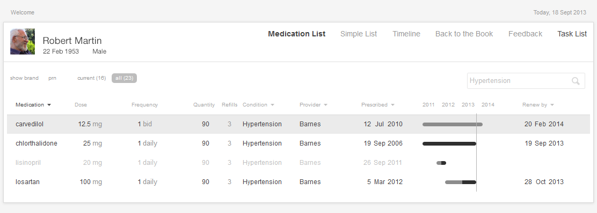](./images/Um_Ehr_0002_condition-focus.png "Filtered by Condition")

Make**dose range information** available**with a click or a tap** by linking the medication name to reference information about that medication. Drug product information databases include information about the recommended dose range for each indication or diagnosis. The maximum dose might be higher for heart failure than it is for hypertension.

Make that same dose range information available at a glance by using an**icon or simple color scheme**. A simple color scheme in which light gray represents a low dose, darker gray a higher dose, solid black a maximum dose, and red a dose over the recommended maximum would reveal relative dosages in a way that elegantly meets physicians’ needs. No clicks, no reading, and no math necessary.

Figure 2.6Shading Displays Information about the Maximum Dose
[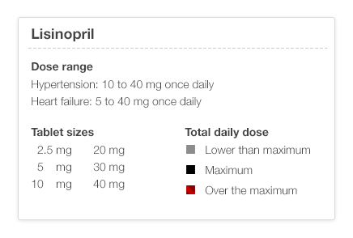](./images/UM_EHR_0009_lisinopril.png "Figure 2.6 - Shading Displays Information about the Maximum Dose")

In any standard EHR table view, that maximum dose indicator could be added with a single small icon for each medication, shown here. This display would also help the patient better understand their medication. By creating visual designs like this that work equally well for physicians, nurses, and patients, we can make the EHR and associated care processes more understandable and transparent for patients.

#### Challenge: Identifying the "Maximum Dose"

Some medications have different minimum and maximum dose ranges depending on the diagnosis. For example, for lisinopril the...Read more

Some medications have different minimum and maximum dose ranges depending on the diagnosis they’re prescribed for. For example, 10 to 40 mg of lisinopril can be taken daily for hypertension, but a patient can take 5 to 40 mg daily for heart failure. The maximum dose for gabapentin is 3600 mg daily for partial seizures or neuropathic pain, and 1800 mg daily for post-herpetic neuralgia. For gabapentin, the maximum dose must be adjusted downward for reduced renal function and, as renal function declines, the maximum allowable dose drops from 1400 mg to 700 mg, and then to 300 mg daily. For patients on dialysis, however, the maximum dose of gabapentin is just 300 mg daily. Development teams will need to check with their pharmaceutical database provider to learn if data about maximum doses is available as discrete data rather than textual data. An EHR that signals maximum doses and provides information about patient characteristics that supports dosage adjustments can help physicians make safe decisions.

For pediatric dosing, age and weight introduce further variables in maximum dose calculations. Some drug dosages should be based on the surface area of a patient’s body (a function of weight and height). An EHR that provides this information in applicable cases will provide effective clinical decision support to providers.

In the examples below ([Figure 2.7](#fig-2-7) and[ 2.8](#fig-2-8)), we refer to the medication timeline (described in detail later in the chapter) embedded in the table view. It uses the same color scheme described earlier (light gray text represents a low dose, darker gray a higher dose, solid black a maximum dose, and red a dose over the recommended maximum).

Figure 2.7List with a Column for the "Maximum Dose" Icon
[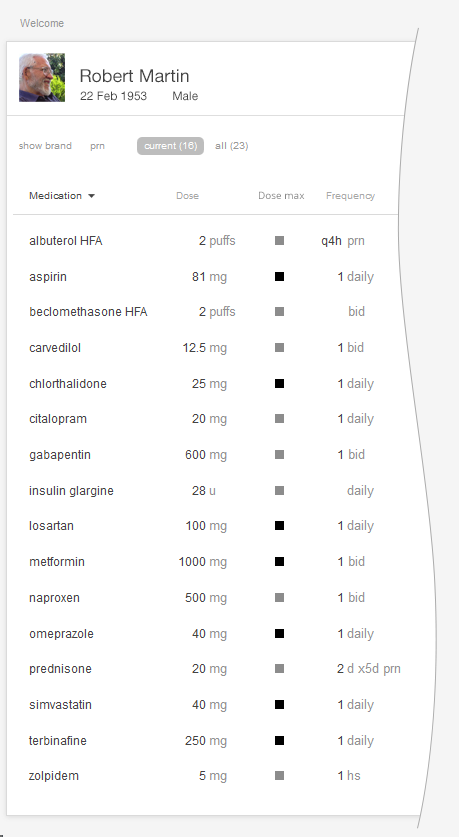](./images/UM_EHR_0007_dose-max.png "Figure 2.7 - List with a Column for the 'Maximum Dose' Icon")

Figure 2.8Mini-Timeline— Shows maximum dose information for each medication
[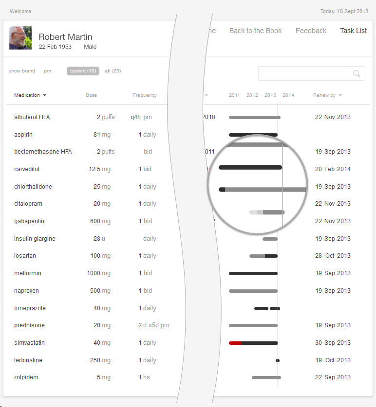](./images/UM_EHR_0008_timeline.png "Figure 2.8 - Mini-timeline shows maximum dose information for each medication")

#### Try It Out

We’ve made an interactive prototype you might like to try out. Imagine a few clinical tasks (we've listed some suggestions below) and, as you work through them, compare this prototype to the tools in your existing EHR and see the difference our changes make in your user experience. Try timing yourself doing a task on the prototype and a friend or colleague doing the same task in your current EHR. Is one tool more accurate for you?

For this prototype, assume “today” is September 18, 2013.

Interactive 2.2Interactive Table Prototype —[Try it out!](../medication-list/)

Try it out:<a>InspiredEHRs.org/medication-list/</a>

Download the code:<a>github/goinvo/ehr</a>

#### Try these tasks:

1.  Is the patient taking insulin?
2.  Is the patient taking any medication for diabetes? How many?
3.  Is the patient taking any medication for high blood pressure (hypertension)? How many?
4.  Could we safely increase the dose on any of those high blood pressure medications? If so, which ones?
5.  For which medications is Dr. Barnes responsible?

</section><section id="timeline" class="section">

* * *

### 2.3[The Medication Timeline](../timeline/timeline.html)

Physicians working with people who have many complex, chronic conditions (diseases), and managing many interventions, such as medications, laboratory tests, occasional procedures, and many visits with multiple health care providers at home, offices, and hospitals, yearn for a timeline that can help them manage all this complex data. Juggling all that data takes a tremendous amount of mental effort (cognitive load). A physician seeking to understand a patient's history with even a single medication may have to dig through progress notes, medication list tables, and years' worth of prescription renewals. The physician might then have to do the whole thing over again to understand the patient's history with a second or third medication.

A medication timeline harnesses the power of information visualization to:

1.  Provide a chronological overview of the patient’s medication history.
2.  Enable physicians to zoom in on and filter the list.
3.  Reveal details on demand.

The overview provides context and perspective, and may enable the user to make salient discoveries. ("Wow, all this patient's meds were changed six months ago.") The timeline visualization helps harness our fast thinking mind, which can quickly make sense of the start and stop images, rather than relying on our slow thinking mind to read dates and make calculations. Zooming and filtering can provide answers to preliminary questions or hunches. Physicians can drill down to seek more specific details, such as the exact dates of medication changes, or related facts that could influence the medical chain of events.

#### Returning to the Clinical Scenario — What Happened Before Today?

Dr. Barnes had determined that Mr. Martin’s blood pressure was too high, and that it would be necessary to prescribe an additional drug. She wondered why lisinopril was not already on this patient’s medication list, since it would normally be among the first three drugs she used for hypertension. So, turning to the medication timeline, she explores the patient’s medication history by toggling from the “Active Medications” view to the “Active & Inactive Medications” view. She sees ([Figure 2.9](#fig-2-9) below) that lisinopril had once been prescribed, but that the patient had only taken it for a few months. She wonders why. Doing a search of the chart, she finds a phone note reporting that the patient developed a persistent dry cough, which had resolved when he stopped taking lisinopril. There was no other record of that adverse effect in the chart, so Dr. Barnes added lisinopril to the allergy list, with “cough” as an “adverse effect.” If her EHR supports the function, she might also write “cough” in the comment field associated with lisinopril under the “reason for stopping” column.

Figure 2.9Show All Medications (Active & Inactive) — Lisinopril had been stopped.[Try it out!](../timeline/)
[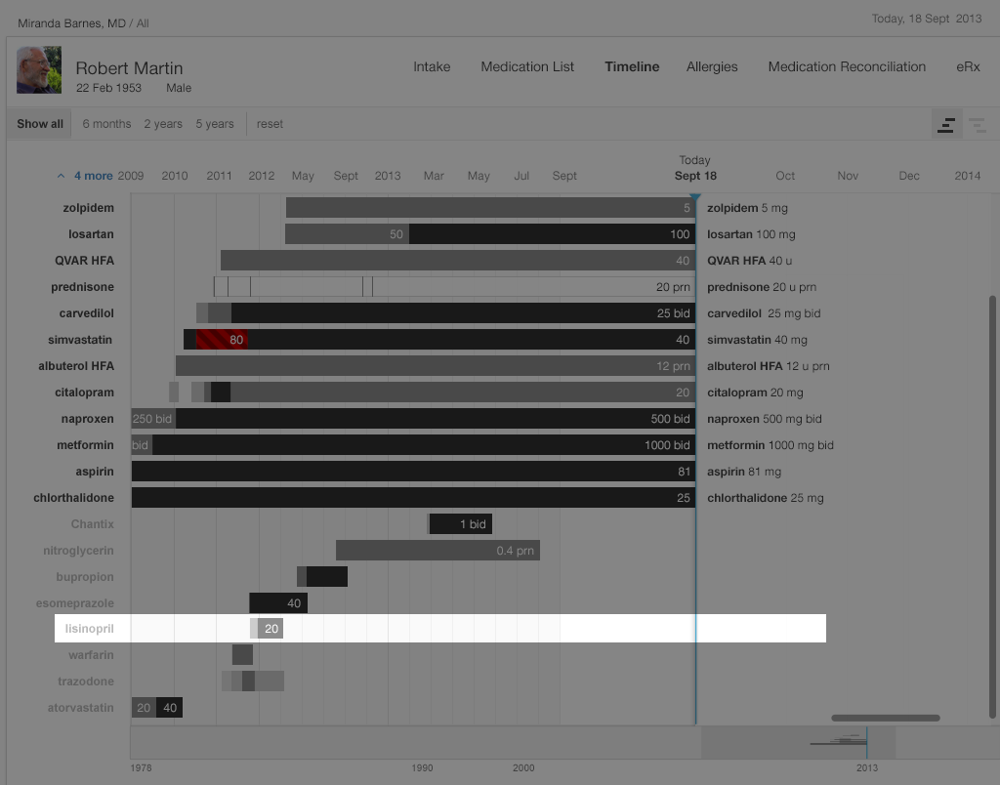](./images/UM_EHR_0007_lisinopril-stopped.png "Figure 2.9 - Show All Medications (Active and Inactive) - Lisinopril had been stopped")

Try it out:<a>InspiredEHRs.org/timeline/</a>

Download the code:<a>github/goinvo/ehr</a>

Dr. Barnes now considers prescribing amlodipine to control the patient’s high blood pressure, but wonders about the patient’s adherence to the medications he’s already on. Zooming in on the medication timeline, she finds that the patient was three weeks late refilling his Coreg, but had been embarrassed to admit to it. The patient had just requested a refill last night and planned to pick it up from the pharmacy after the visit today. Coreg’s relatively high co-pay made the patient hesitant to refill his prescription in a timely manner. With this brought to her attention, the physician discussed less expensive alternatives in the beta-blocker class. Together they selected metoprolol XL 200 mg daily. You can read more about why patients might not be taking their medication as prescribed in[Chapter 3, Medication Reconciliation](./medication-reconciliation.php).

ingFigure 2.10Zoom in to See Granular Details like Gaps in Medication Adherence
[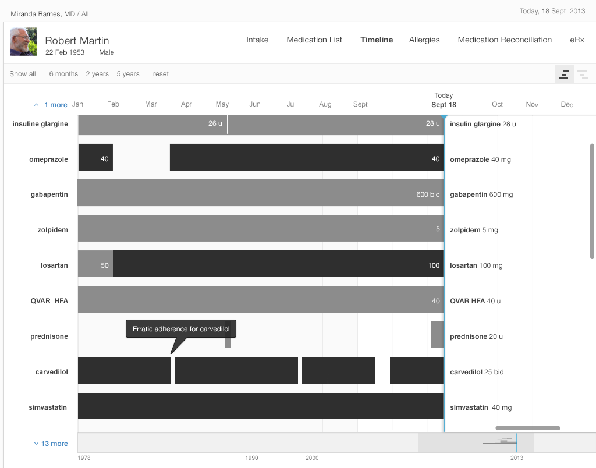](./images/UM_EHR_0008_zoom-in.png "Figure 2.10 - Zoom in to See Granular Details like Gaps in Medication Adherence")

A timeline offers a complete overview. At the top level, a timeline conveys details about when a patient starts and stops taking a medication, when that medication's dose changes, whether that change is an increase or decrease, and whether the dosage taken is the maximum one.

In the straightforward timeline presented in[Gallery 2.4](#gal-2-4), each bar represents the history of a single medication (e.g. citalopram started at 10 mg, and the dosage progressively increased to 40 mg daily). The physician can adjust the timescale to give a wider or narrower view of the patient’s medication history. Solid black represents the maximum dose of that particular medication, with shades of gray representing progressively lower doses (lighter means lower). This design presents the user with a wealth of information at a glance.

Highly usable EHR designs can accommodate large medication lists. Patients with an array of complex problems can have 15 to 20 medications on their active list, and ideally physicians dealing with challenging cases such as these won't have to scroll to view all of a patient's medications at once.

All instances of a medication (e.g. citalopram) will occur in the same timeline, even if they involve different tablet strengths (10 mg, 20 mg, or 40 mg) or occur at distinct points in time (say, an eight month course four years ago, and another course for the past twelve months).

Gallery 2.4Medication Timeline

*   

2.4 a Medication Timeline Showing Drug Dosages for "Today"

*   

2.4 b How to Read the Timeline
[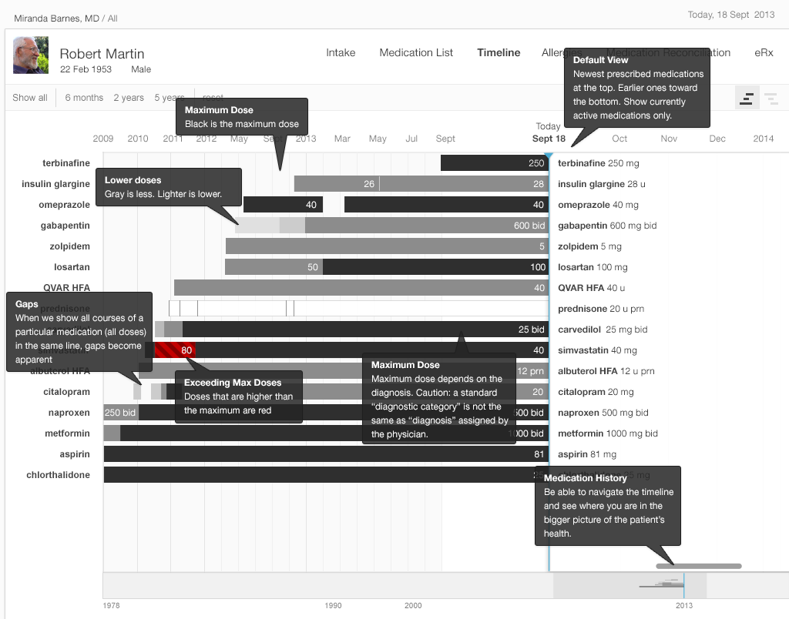](./images/UM_EHR_0010_notated.png "Gallery 2.4 b - How to Read the Timeline")

*   

2.4 c Special Cases— PRN (as needed) medications and medications with no fixed maximum dose
[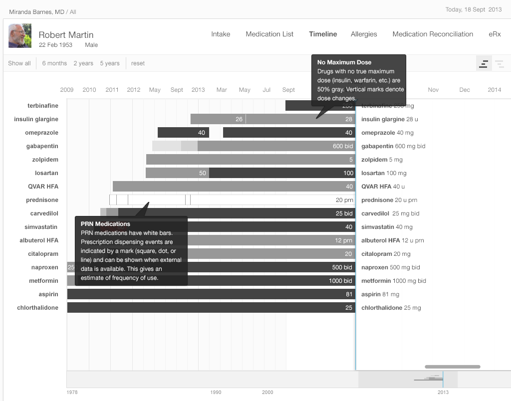](./images/UM_EHR_0011_notated-2.png "Gallery 2.4 c - Special Cases - PRN (as needed) medications and medications with no fixed maximum dose")

The medication timeline we illustrate incorporates some innovative interface usability features predicated on cognitive science. The efficient “high-level overview” shows the timeline for a patient’s complete list of medications in a single view. This tool will eliminate the need for the user to try and hold all these disparate pieces of information in her working memory, or to make written notes just to keep track of the details scattered across several EHR views. A physician looking at this visualization will pick up on[preattentive attributes](./human-factors.php#preattentive-attributes) (See Prattentive Attributes in the Human Factors chapter) such as color, length, and[proximity](./human-factors.php#proximity)(See Proximity in the Human Factors chapter), and will be able to discern patterns in these far more easily than she might see them in text or numerical data.

Our physician will also be able to zoom in on areas of interest and explore them in more detail. The EHR can provide her with explanations, dose details, and even adherence information if pharmacy refill data or patient-reported adherence data is available. This will further assist our physician to confirm hunches and develop new questions to pursue.

The EHR can also display any episodic medications a patient has been prescribed, such as PRN medications for pain, nausea, asthma exacerbations, etc. In[Gallery 2.5](#gal-2-5), these are represented by a white bar. The EHR will display that a patient has used these medications by means of additional visual cues. An EHR might indicate pharmacy dispense events with a square or dot, and patient reports of medication use with a small vertical hash mark.

EHR filtering can be capable of showing only active medications, discontinued medications, or both, as needed. This will help physicians answer other questions that arise during their inquiries (“Why was this medication stopped last December, and what made the patient switch to this alternative medication?”).

For the timeline, we used monochrome (grayscale) to convey most information. EHRs with specific color schemes could adapt our black scheme for conveying a maximum number to a “darkest blue” or “darkest green”. We used color sparingly, to alert physicians to issues such as dosages over the recommended maximum dose. In general, it’s a good idea to design in monochrome first. You can then add color sparingly to convey meaning in a way that won’t distract the user. Remember that some users will not perceive color. In our example, we combined color and cross hatching when we needed to indicate a maximum dose to make sure that no one missed crucial information due to this quite common disability. You can make sure you’ve designed for maximum accessibility by printing your design in grayscale and checking that all the information it is supposed to convey is still visible.

Above all, the text must be legible. On our timeline, the drug names are left-justified, which makes them easier to read. The dose, displayed in either black or white, contrasts with the background. Experienced, dexterous users can comfortably manually zoom in on our timeline, but even absolute beginners can use the buttons that allow them to quickly zoom in on commonly-used, useful time periods (such as “the last three months” or “the last year”).

Our medication timeline aims to accommodate every conceivable user: physicians, nurses, patients, caregivers, pharmacists, mental health professionals, health coaches, and all other medical specialists. It can accommodate long lists of medications. A dozen medications can be quite common. Twenty medications would not be surprising. Thirty medications, sadly, may not be rare. The medication timeline handles the visual burden with ease. It’s a tool for data visualization, whose mantra is “overview first, then zoom and filter, then details-on-demand.” Let’s look at[Gallery 2.5](#gal-2-5) to demonstrate how.

Gallery 2.5Medication Timeline

*   

2.5 a Instructions on How to Read the Timeline
[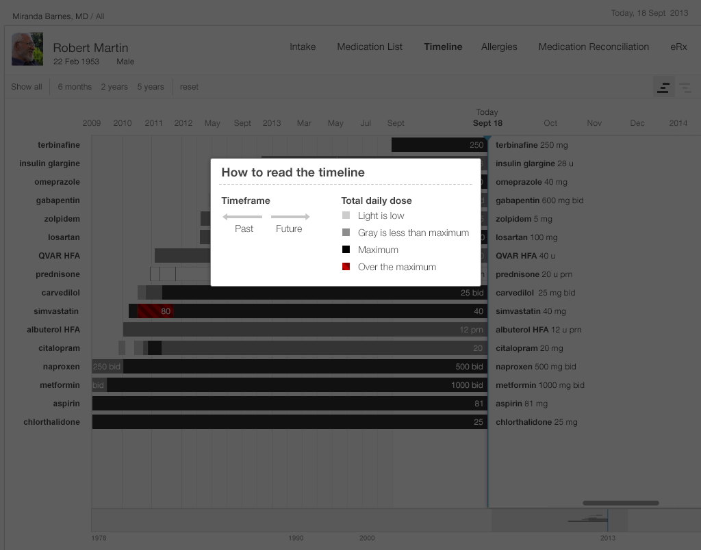](./images/UM_EHR_0001_tutorial.png "Gallery 2.5 a - Instructions on how to read the timeline")

*   

2.5 b Active Medications in the Timeline

*   

2.5 c Grab the Scrubber— Drag it across the timeline to look at more details about certain dates.
[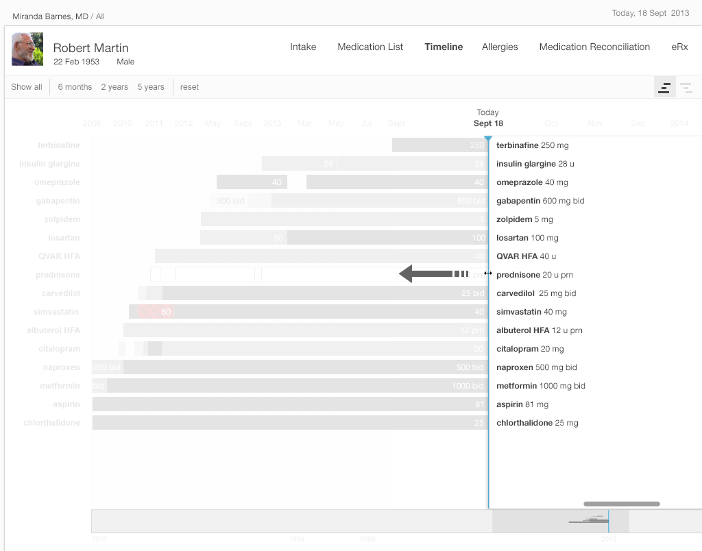](./images/UM_EHR_0002_drag.png "Gallery 2.5 c - Grab the Scrubber - Drag it across the timeline to look at more details about certain dates")

*   

2.5 d Dragging the Scrubber Further Back in Time— Medications not yet prescribed appear as grayed out names, and the labels disappear.
[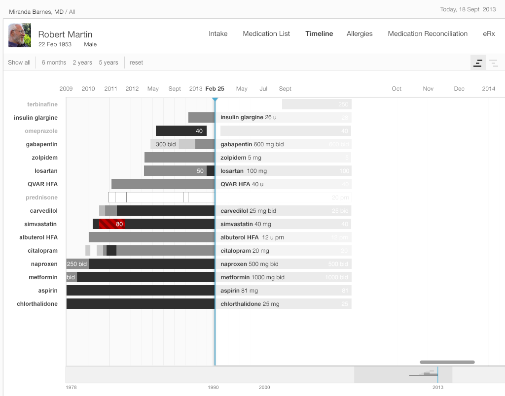](./images/UM_EHR_0003_drag2.png "Gallery 2.5 d - Dragging the Scrubber Further Back in Time - Medications not yet prescribed appear as grayed out names, and the labels disappear")

*   

2.5 e Show All Medications— Active medications are at the top, inactive medications are at the bottom.
[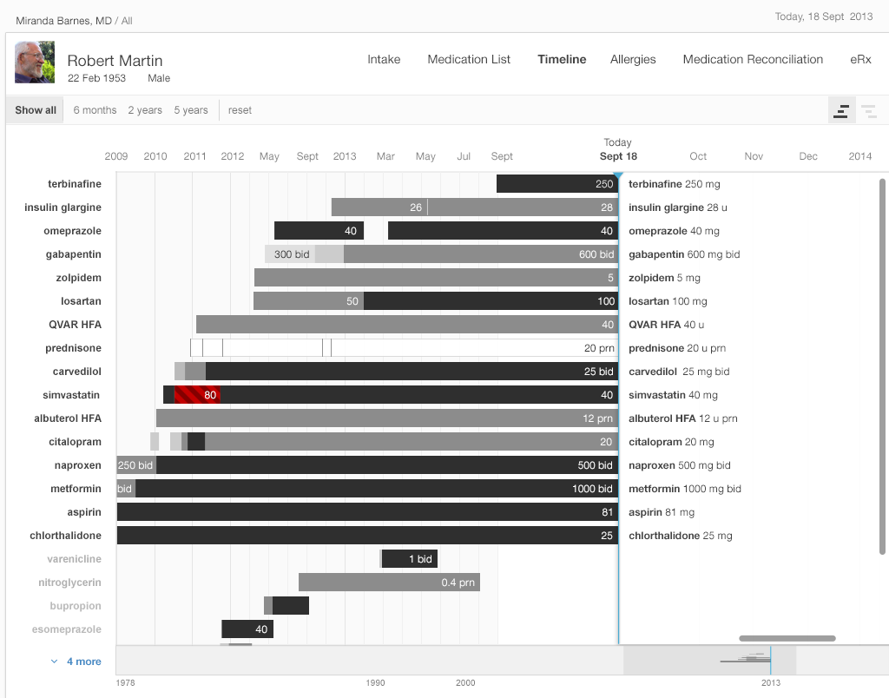](./images/UM_EHR_0004_show-all.png "Gallery 2.5 e - Show All Medications - Active medications are at the top, inactive medications are at the bottom")

*   

2.5 f Tap on a Medication Line to See More Details
[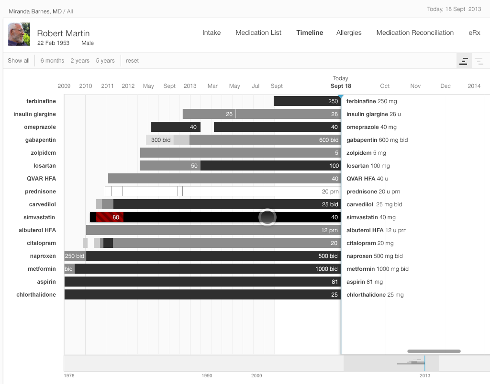](./images/UM_EHR_0005_hover.png "Gallery 2.5 f - Tap on a Medication Line to See More Details")

*   

2.5 gExpanding a Bar Reveals Details that Influenced a Patient’s History with a Medication— Such as their reason for discontinuing it. Access other details (pharmacy, prescriber, etc) by linking a drug timeline to that drug in the interactive table.
[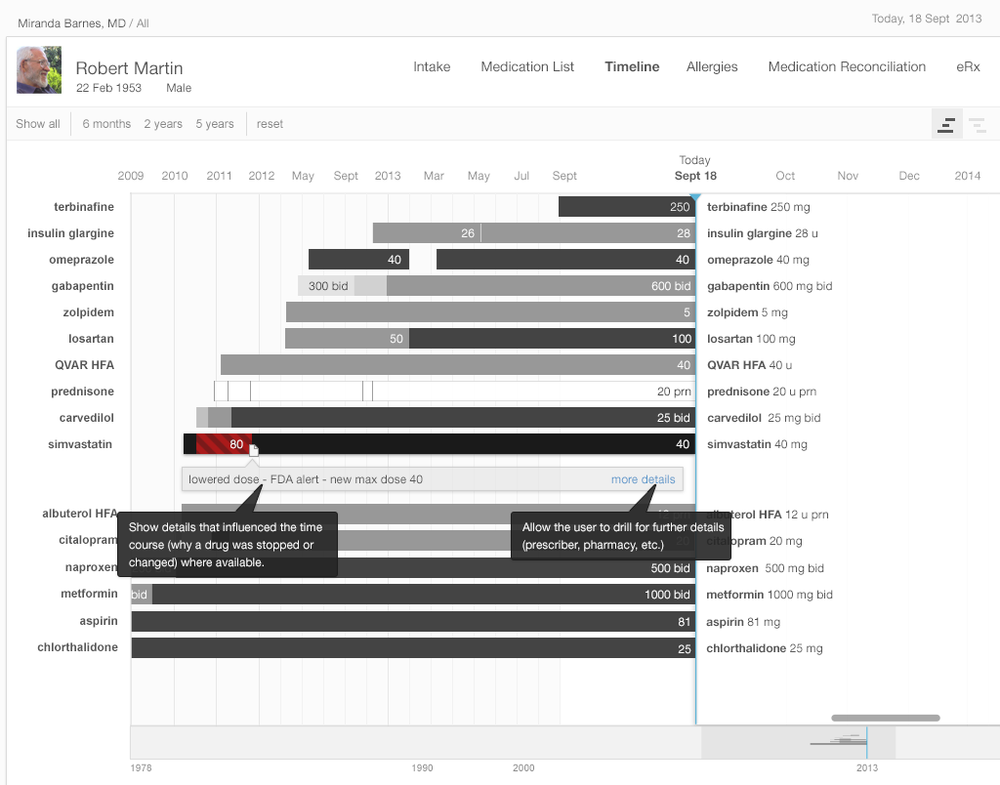](./images/UM_EHR_0013_tap1.png "Expand a Bar to Reveal Details on a Patient’s History with a Medication")

*   

2.5 hBack to Where We Started

See the Timeline in action in this short demo video.

Video 2.1[Watch the Demo Video of the Timeline Prototype](http://vimeo.com/99496442)(4:29)

#### Try It Out

We’ve made an interactive prototype timeline you might like to try out. Imagine a few clinical tasks (we've listed some suggestions below) and, as you work through them, compare this prototype to the tools in your existing EHR and see the difference our changes make in your user experience. Try timing yourself doing a task on the prototype and a friend or colleague doing the same task in your current EHR. Is one tool more accurate for you?

Note that this is an early prototype with known limitations we hope to address in future versions of the book (e.g. improved zooming, better labels for the time axis, customizable use of color, access to notes and details about reason for changes, filters, etc.)

For this prototype, assume "today" is September 18, 2013.

Interactive 2.3Medication Timeline Prototype[Try it out!](../timeline/)

Try it out:<a>InspiredEHRs.org/timeline/</a>

Download the code:<a>github/goinvo/ehr</a>

#### Try These Tasks

1.  Navigate so that you can see the starting date, September 18, 2013, by dragging the gray shaded area (the scrubber) in the bottom timeline. (We set a current date of September 18th so our prototype will work both now and for years to come).
2.  What medication did the patient start taking most recently? About when did he start taking it?
3.  Which medication did the patient stop taking most recently?
4.  Drag the scrubber at the bottom of the frame until you can see a 5-year timeline.
5.  Which drugs did the patient stop taking, and then start taking again?
6.  Try dragging the list of medication names on the right side of the frame towards the left. Notice that some names disappear. Only the drugs and the dosages the patient was taking at the point in time you’ve moved the scrubber to will show up on the list.

#### Future Directions for Medication Timeline

Our timeline doesn’t yet provide all the answers. We haven’t attempted to address the data needs of complex regimens like chemotherapy, or the variables involved in pediatric dosing. Other clinical tasks really demand a historical view that integrates other clinical data. For example, warfarin anticoagulation management requires details about prior warfarin dose changes, other medication changes, and prothrombin time (also known as protime, or PT or INR) lab results. Insulin management requires physicians to be able to simultaneously view recent blood glucose results, hemoglobin A1c results, diet and activity details, and sometimes other details about exceptions to the patient’s usual condition or activities.

A graphical display of laboratory values to accompany the timeline may help physicians even more. An ideal timeline for cases such as these would allow physicians to see what medication changes, if any, preceded a rise in laboratory markers of liver injury, or how a blood pressure medication affected electrolytes and kidney function. This type of display could enhance patients’ safety and quality of care by presenting information in a way that makes currently obscure patterns and phenomena crystal clear for the user.

#### Different Medication List Designs Address Different Users’ Tasks

Read more

**For Prescribers**

<table class="sidebar-table" id="prescribers"><thead><tr><th>User Tasks</th><th colspan="3">Capabilities</th></tr><tr><th>Simple List</th><th>Interactive Table</th><th>Medication Timeline</th></tr></thead><tbody><tr><td>**Scan the list quickly**</td><td>●</td></tr><tr><td>**Manage treatment decisions**  
(Big picture overview to guide decisions)</td><td>●</td><td>●</td></tr><tr><td>**Renew medications**  
(For when to renew and for making adjustments)</td><td>●</td></tr><tr><td>**Perform medication reconciliation**  
(Comparing two or more lists at transitions of care)</td><td>●  
but see later chapter</td></tr><tr><td>**Review time course**</td><td>●</td></tr><tr><td>**Manage temporary changes**

Brief courses (steroid bursts or intermittent treatment such as chemotherapy)

**Adjustments around procedures** (adjustments & temporary medications needed around the time of surgery)

</td><td>●  
If sort by "expected stop date"</td></tr><tr><td>**Recall tried & failed medication courses**  
(What was effective, what wasn't, and why?)</td><td>●  
But only if the details are recorded by the users</td></tr><tr><td>**Assess adherence**  
(Are refills on time? Are doses taken as planned?)</td><td>●  
Depends on additional data, such as dispense data or patient reporting</td></tr></tbody></table>
#### For Patients

<table class="sidebar-table" id="patients"><thead><tr><th>User Tasks</th><th colspan="2">Capabilities</th></tr><tr><th>Simple List</th><th>Interactive Table</th></tr></thead><tbody><tr><td>**Scan or remember the list**</td><td>●</td></tr><tr><td>**Share the list with others**</td><td>●</td></tr><tr><td>**Restock the[pill organizer](http://en.wikipedia.org/wiki/Pill_organizer)**  
(Shows which pills go in which slots of those little weekly boxes)</td><td>●  
barely</td></tr><tr><td>**Remember daily doses**  
(Reminds users about daily and less frequent doses and "less than daily" doses. Enables users to check items off the list when they’ve taken them)</td><td>●</td><td>●</td></tr><tr><td>**Remember pharmacy refills**  
(Helps users coordinate trips to the pharmacy and ask their doctors for renewals)</td><td>●  
Would need data from pharmacy, or from bottle</td></tr><tr><td>**Update list at end of doctor visit**  
(Creates a final list that takes into account all the changes to the medication list that have been made during a given clinical encounter)</td><td>●</td></tr></tbody></table>

</section><section id="summary" class="section">

* * *

### 2.4 Summary

1.  When designing EHR tools, consider the user and the task they’ll be performing. This will help you decide what functions and details a physician needs when using a particular medication list view.
2.  Use[preattentive attributes](./human-factors.php#preattentive-attributes) (See Preattentive Attribute in the Human Factors chapter) (like color, size, shape and alignment) to draw the user’s attention to the salient details.
3.  Design in monochrome first, then add color sparingly and meaningfully where it can add information without distracting the user.
4.  Remember that humans have very limited[working memory](./human-factors.php#working-memory) (See Working Memory in the Human Factors chapter), especially for complex or compound items like medications and dosages. Where possible, put information directly in view. Eliminate the need for physicians to remember details from one step to the next in a task sequence.
5.  Enhance users’ situational awareness by giving them an overview of all the key details.
6.  Reduce users'[cognitive load](./human-factors.php#cognitive-load) (See Cognitive Load in the Human Factors chapter). Do the math for them. Design to minimize repetitive reading. Present the information directly instead of requiring the user to recall it.
7.  Remember the data visualization mantra: overview first, then zoom and filter, then details-on-demand.
8.  Design to accommodate large medication lists. Remember that it’s not uncommon for some patients to have 15-20 medications on their active list. Try to design lists that don’t require users to scroll to see all the medications at once.

