## 4

## 过敏列表

简化数据录入，以简洁、整齐的展现形式强调重要的过敏信息
Streamline data entry and create clear, uncluttered displays to highlight important allergies.

* * *

目前药物过敏列表(或简称为过敏列表)包含了患者已知的药物过敏，但可以包含更多信息。

Medication Allergy Lists (or simply Allergy Lists) currently include a patient’s known medication allergies, but they could include more.

医生、护士、患者和药剂师一贯地将患者真正的药物过敏，其他的诸如头晕、恶心等ADR药物不良反应(也被成为副作用)以及其他的不良反应包括在不良反应列表之中。
本章中，我们关注真正的药物过敏和药物不良反应。医生常常也会把对其他物质(诸如乳胶、胶带、花生和其他食物)的过敏纳入到过敏列表之中。

Historically, physicians, nurses, patients, and pharmacists have included patients’ true drug allergies, other adverse drug reactions (also known as side-effects or adverse effects) such as nausea or drowsiness, and allergic reactions in their allergy lists. In this chapter, we will focus on true drug allergies and adverse drug reactions. Physicians often also include patients’ allergies to substances other than medications (such as latex, adhesive tape, peanuts and other foods) in Allergy Lists.

>#### 其他类型的过敏

>过敏列表中常常不包含吸入剂过敏(诸如哮喘、花粉热、或粉尘、霉菌过敏)，而是把它们放在问题列表中。极少的药物不良反应会影响处方。
一些注射用药物会使用花生油，氨基葡萄糖片可以来自贝类，对鸡蛋、大豆过敏的患者不应服用propofol异丙酚。

>Inhalant allergies (such as asthma, hay fever, or allergies to dust and mold) are usually not included in the Allergy List, but rather in the Problem List. Very few food allergies could have an effect on prescriptions. A few injectable medications use peanut oil, glucosamine tablets may be derived from shellfish, and patients with egg or soy allergies should not be prescribed propofol.

某种程度上，过敏列表是支撑用药列表的保障网。医生根据过敏列表来核对用药列表确保患者安全。过敏性的不良反应可以有轻微和致命之分，因此过敏列表要保持时刻最新来避免此类事
件的发生。良好的设计能够简化纠正过敏列表中的错误。

In one way, the Allergy List is the safety net that supports the Medication List. Physicians check the medication list against this list of allergies in order to ensure patient safety. Allergic reactions can range from minor to fatal, so the Allergy List needs to be kept current to prevent these events. Good design can simplify correcting errors in the Allergy List.

* * *

### 4.1 三大主要任务 Three Main Tasks

开发人员在设计过敏列表时要时刻记住用户的三大任务：浏览、查看和变更列表。

Developers might design Allergy Lists keeping in mind a user's three main tasks: glancing, exploring, and changing the list.

**浏览过敏列表** 可能会得知患者没有任何已知的药物过敏-或者说患者对医生开给他的药物是严重过敏的。通常，理想情况下，在医生下处方或给药时，医生和护士需要快速查看过敏列表

**Glancing at the list** may reveal that a patient has “no known medication allergies” – or that he’s deathly allergic to the medication the physician is about to order for him. Often, ideally every time they prescribe or administer a new medication, doctors and nurses will need to quickly refer to the Allergy List.

**查看详细信息** 可能会帮医生权衡某种药物的好处是否大于风险

**Exploring the details** may help a physician decide whether a drug’s benefits outweigh the risks.

可以很快速直接地**添加新的条目**到过敏列表.在了解最少信息的情况下快速、灵活地**编辑过敏列表**.

**Adding new entries** to the list can be quick and straightforward.**Editing the list** can be fast, assured, and flexible, requiring minimal details.

让我们来看一看如下会用到这三大任务的临床场景，一些能够更好解决场景和任务中需求的设计技巧。

Let's consider the clinical scenarios prompting our three tasks, and some design makeovers that better address the needs of these scenarios and tasks.

* * *

### 4.2 浏览过敏列表 Glancing at the Allergy List

>#### 临床场景——考虑下达新处方

>一位年轻的女性到 Dr Barnes 医生处看诊，看起来就是简单的膀胱感染。对于此类症状， Dr Barnes 医生通常会开抗生素sulfamethoxazole / trimethoprim (or Bactrim)
，但在快速浏览患者人口学信息中的过敏列表之后发现，该患者对诸如Bactrim的sulfa 磺胺类药物过敏，于是，医生选择了ciprofloxacin盐酸环丙沙星，一种更为适合便宜的药物。

>A young woman visits Dr. Barnes with what seems to be a simple bladder infection. Dr. Barnes would normally prescribe the antibiotic sulfamethoxazole / trimethoprim (or Bactrim) for this complaint, but a quick glance at the allergy list in the patient's demographic banner reveals that this patient is allergic to sulfa drugs such as Bactrim. Instead, Dr. Barnes prescribes ciprofloxacin, a suitable and equally inexpensive drug.

医生每次开新的药物之前，都会快速过一下过敏列表，可能会询问患者是否对药物过敏。

Every time they prescribe new medication, doctors will need to quickly refer to the Allergy List and may ask patients if they are allergic to the drugs in question.

对于此类任务，医生需要浏览一份简短的只包含患者会过敏的药物名称的列表。在医生下处方或给药时，该列表要保持清晰可见，但在执行无关操作比如在病历中记
录本次就诊时，则不需要看到该列表。可以把该列表放在患者人口统计学信息部分，这样不管医生是否需要，该列表总是可见的。

For this task, physicians need to be able to glance at a short list that only contains the names of the drugs a patient is allergic to. This list could be clearly visible when physicians are prescribing or administering, but they don't need to see it when performing unrelated tasks, such as documenting the visit in a note. The list could be included in the patient demographic banner, where it would always be visible even while physicians do tasks that don't require it.

开发人员通过让医生所需要的信息更加易于找到，减少不必要的详细信息，能够尽可能简化执行这样任务时医生的认知负载，减少脑力劳动。电子病历系统的切换需要耗时耗力，
查找过程中的记忆会增加早已不堪重负的医务人员的认知负载。

Developers can work to minimize physicians' cognitive loads, or the mental effort they must expend to perform this task, by making the information physicians need easy to find, and by not over-burdening them with unnecessary details. Navigating through the EHR requires time and effort, and remembering where they need to look increases the cognitive load on often already-overburdened health care providers.

我们模拟了以前和未来的过敏列表 ([Figures 4.1](#fig-4-1) and[4.2](#fig-4-2))来给大家演示我们所说的内容。

We've mocked-up "before and after" versions of an allergy list ([Figures 4.1](#fig-4-1) and[4.2](#fig-4-2)) to illustrate what we mean.

该例子中使用了很小的空间来罗列症状，除非用户把鼠标挪(悬停)到这个列表中，否则不会显示可能很长的该列表中的所有项目的总数。然后，用户可能使用的是触屏，
触屏不支持悬停操作。因此这样形式存储的信息可能对某些用户是很难获取的，使用点击操作而非悬停操作能够解决这样的问题。在这里罗列其他的药物能够更大程度
的帮助医生。在浏览过程中，医生需要知道是否已经查看了过敏列表中的所有物质，或者是他们所看到的内容是节选的。

This example ([Figure 4.1](#fig-4-1)) uses some of its limited space to list symptoms. The total number of items in this potentially long list is not visible unless the user hovers over the list with a mouse. The user may, however, be using a touch interface, and touch interfaces don't allow users to hover. Thus information stored in this format isn't easily accessible to some users; making use of a click or tap instead of hover will help. Listing additional substances here would actually help physicians out more. Physicians need to know, at a glance, if they're seeing all the substances on the Allergy List, or if what they're looking at has been truncated.

Figure 4.1 **Before: Glancing at the List**— A design that hides key details

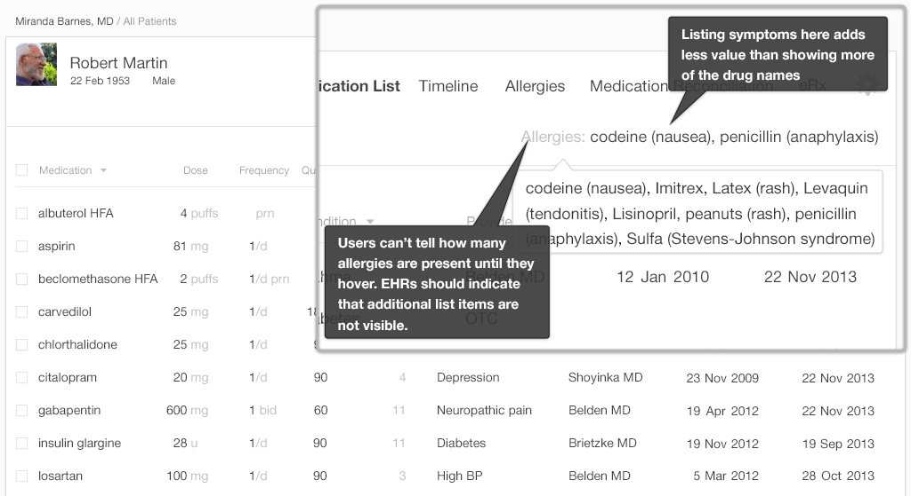

Figure 4.2 **After: Glancing at the List** — A design that brings key details to the forefront

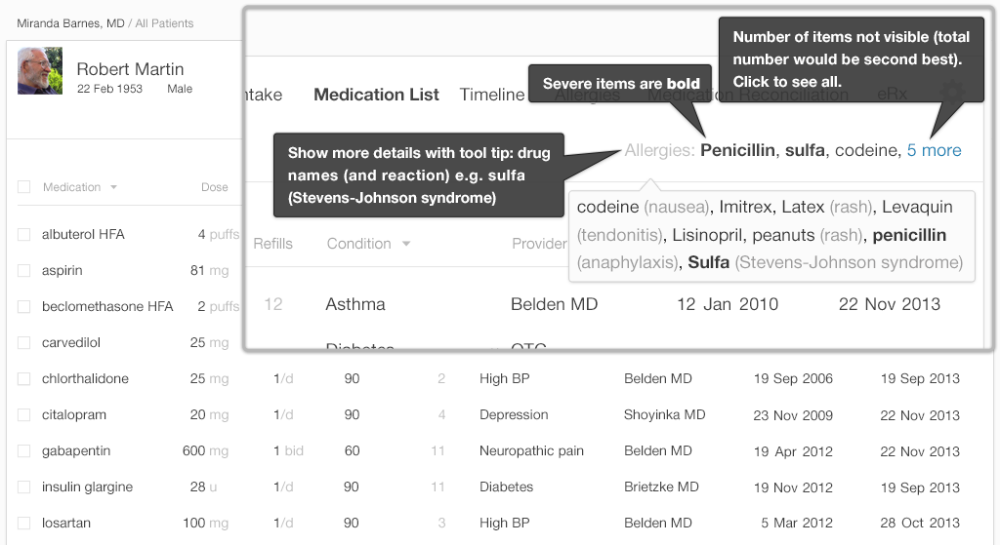

在“after”的例子中，不显示症状我们就能够展示更多的药物。"5 more 5项更多内容"的标记比悬停的功能要更明显、更好用，
能够明确的告诉用户患者还有5个药物过敏未显示。如果只是数字没有更多的话也会比较含糊。在第一次浏览之后，我们通常会得到数字所代表意义的结论(是总数是
    5呢还是还有5个没看到)

In our "after" example ([Figure 4.2](#fig-4-2)), by not listing the symptoms we were able to show more substances. The "5 more" indicator is more obvious and helpful than the hover-function it replaces, clearly telling users that the patient has five more drug allergies which are not displayed in this concis·e view. The number without the word “more” could be confusing. At first glance, our minds will try to jump to a conclusion about what the number means (Is it a “total of 5,” or are there “5 more” to be seen?).

像我们这样，把过敏列表放在患者的人口统计学banner中，是一种把过敏列表和工作流结合起来的方式。在工作流程中，过敏列表可以在医生输入新的处方或续药时弹出。
([Figure 4.3](#fig-4-3))。这样在医生下达处方时仍然能够及时的看到过敏列表。大多数工作流程如查看检验结果或生命体征，阅读检查报告，则不需要患者的药物过敏信息。

Including the Allergy List in the patient demographic banner, as we've chosen to do, is one means of incorporating this list into the workflow. The Allergy List could only pop up in the workflow when the physician enters a new medication prescription or renewal ([Figure 4.3](#fig-4-3)). This would still make the Allergy List readily available to a physician making prescriptions. Most other workflows such as reviewing lab results or vital signs or reading reports, don’t require that the physician be aware of a patient's medication allergies.

Figure 4.3 **Add Prescriptions**

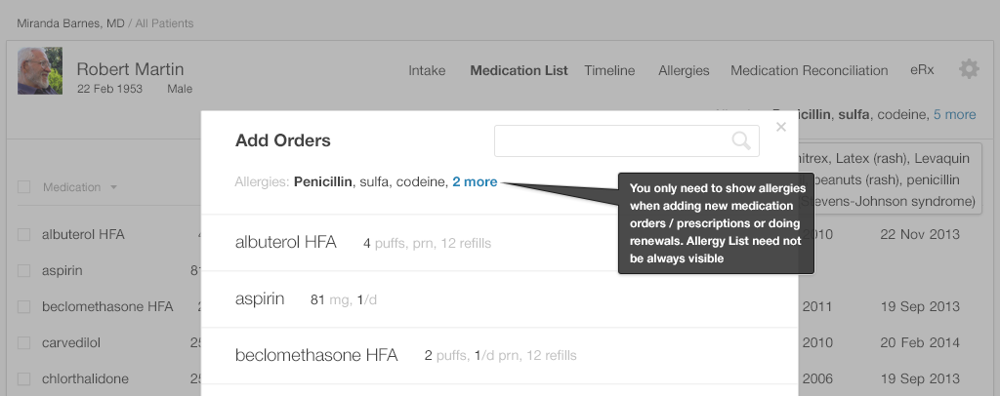

* * *

### 4.3 查看详细信息 Exploring the Details

有时候，医生想要了解过敏列表中某个药物过敏的详细信息。信息的准确度如何？使用该药物的潜在风险是否超过了它所带来的好处，比方说更低的成本或更高的效率？

Sometimes a physician wants to know a bit more detail about a drug allergy on the list. How accurate is the information? Are the potential risks of using the drug outweighed by strong benefits, such as increased effectiveness or significantly lower costs?

>#### Clinical Scenario — Reviewing Allergy Details

>Dr. Barnes 医生正在对一名38岁的4个孩子的父亲进行问诊，前两天，患者的喉咙越来越疼痛，五天前，他的一个孩子从学校回来就发烧和头痛。患者的快速链球菌检
查显示他患有咽喉炎。

>Dr. Barnes is seeing a 38-year-old father of four. For the last two days, the patient's throat has been getting increasingly sore. Five days ago, one of his children came home from school with a fever and headache. The patient’s rapid strep test indicates that he has strep throat.

>一般情况下，Dr. Barnes会开青霉素，因为青霉素很便宜也很有用。但若干年前，患者曾有过一次严重的青霉素过敏，出现过荨麻疹和嘴唇肿胀。医生的第二选择是
头孢氨苄 cephalexin (Keflex)。但青霉素和 头孢氨苄 cephalexin (Keflex)化学上是类似的，如果患者对青霉素严重过敏的话，也可能对 头孢氨苄过敏。
其他情况下则是可以安全使用的。

>Dr. Barnes would usually prescribe penicillin because it's cheap and effective. A few years ago, however, the patient had a severe reaction to penicillin, which included hives and a swelling of the lips. The physician's next choice would be cephalexin (Keflex). Because penicillin and cephalexin are chemically similar, if the patient's allergic reaction to penicillin was truly severe, he might also have an allergic reaction to cephalexin. Other times it may perfectly safe to prescribe.

>头孢氨苄 对于轻微青霉素过敏的患者是安全的，但严重青霉素过敏的患者应避免使用头孢氨卡。第三选择是clindamycin or azithromycin，这两种药
都比较昂贵。

>Cephalexin can be perfectly safe for people with a mild penicillin allergy. However people with a severe penicillin allergy should avoid cephalexin. The third-choice alternatives would be clindamycin or azithromycin (Z-Pak), both of which are more expensive.

在浏览患者人口统计学信息banner ([Figure 4.4](#fig-4-4))的时候，医生能够掌握一些信息，但仍然需要更多详细信息。患者服用这种药物会出现什么样的结果？
患者的不良反应会不会很严重？

Glancing at the patient demographic banner ([Figure 4.4](#fig-4-4)), the physician can see some information, but she still needs more details. What exactly happened when the patient took this drug? Was the patient's reaction severe?

Figure 4.4 **Patient Demographic Banner**— Shows only medication names.

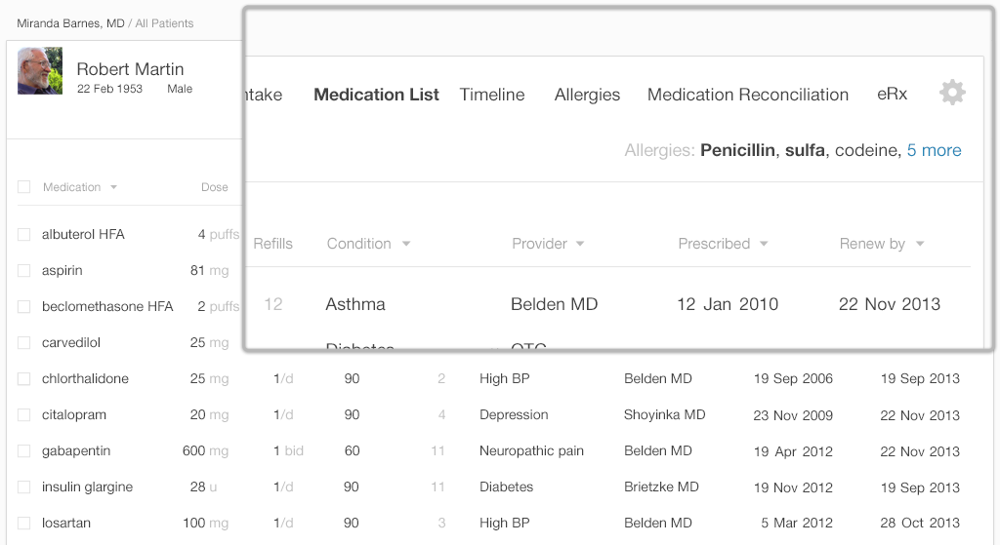

要了解额外信息，医生需要使用如下的表格视图([Figure 4.5](#fig-4-5)).

To get this additional information, the physician will have to use the detailed table view ([Figure 4.5](#fig-4-5)).

Figure 4.5 **Medication Allergy List**— Table view shows details.

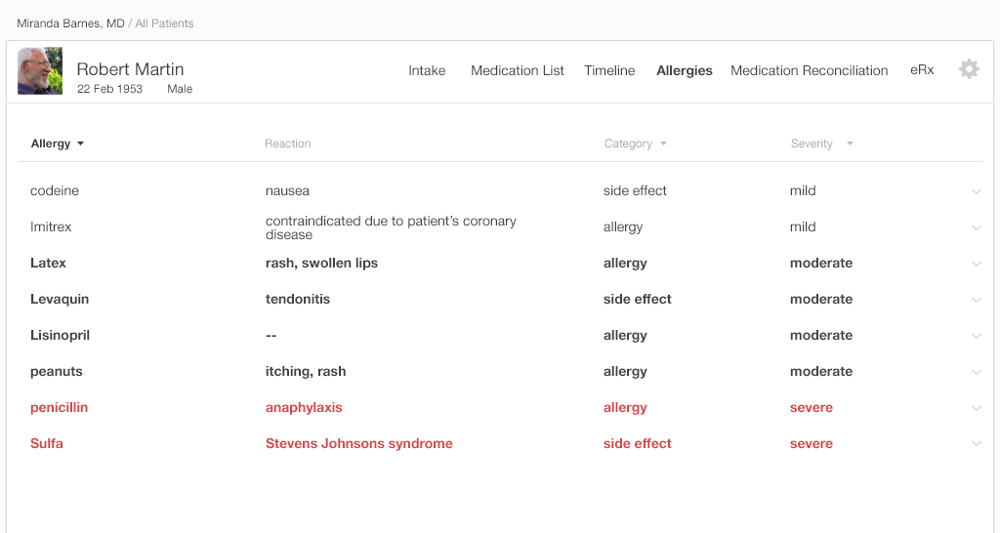

有了如图([Figure 4.5](#fig-4-5)),医生或护士能够了解到他们所需要的信息。相对重要的信息位于左面，相对不重要的则在右面。表格是简单高效的，
能够显示有限的信息，减少用户的视觉负载。更深一步的话，用户能够获取更多信息。

With this list ([Figure 4.5](#fig-4-5)), the physician or nurse can see the information they need. More important information is on the left, and less important information is on the right. The table is simple and effective. It shows limited information and reduces the visual load on the user. By drilling a step deeper, the user can access further details.

Figure 4.6 **Users Can Click Rows to Either Edit Them or to See More Details**

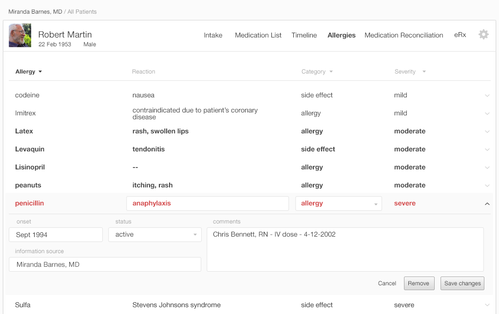

>#### 对于医生而言，过敏列表中哪些信息是重要的 ？

>了解用户，了解用户的需求。我们在多家机构对医生和住院医做了一个简单的采样调查问卷，询问他们觉得哪些内容很重要，应该包含在用药过敏列表里面。
共收到52个回复，调查中并未考虑那些会随着时间变化的法律方面的要求。

>Know your user and their needs. We sent a convenience-sample survey to mostly academic health center physician faculty members and residents at several institutions, asking what they felt was important to include in a Medication Allergy List. We had 52 responses. Our survey didn't consider regulatory requirements, which might change over time.

>Figure 4.7 **What Allergy List Details are Important to You?**

>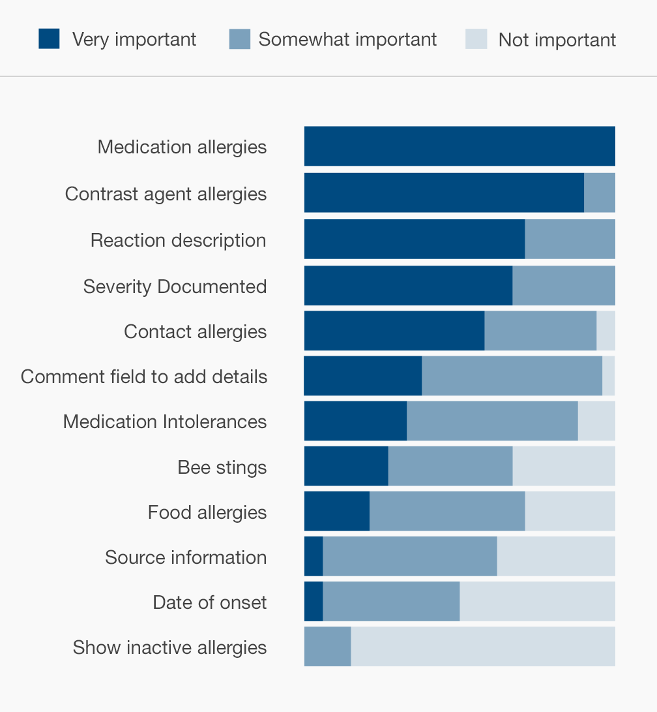

>此类用户不需要知道无效过敏信息，过敏的始发日期，过敏信息来源于哪个电子病历系统。在日常使用过程中隐藏这些信息是安全的。

>These users don't often need to know about inactive allergies, allergies' dates of onset, or the source of the EHR's information about these allergies. It's safe to hide this information in the course of regular usage.

* * *

### 4.4 变更过敏列表(新增和编辑)

>#### 临床场景—修改过敏列表

>Dr. Barnes医生正在问一位成年患者问诊，这位患者过去两个礼拜一直鼻窦发炎。Dr. Barnes医生想开抗生素Augmentin。在准备过程中，
她问患者是否有任何过敏，同时浏览了一下人口统计学信息中的过敏列表。

>Dr. Barnes is seeing an adult patient who has had a sinus infection for the past two weeks. Dr. Barnes would like to prescribe the antibiotic Augmentin. As she prepares to do so, she asks the patient whether he has any drug allergies, while simultaneously glancing at the patient's allergy list in the demographic banner.

>患者过敏列表中包含 Augmentin，但没有记录任何对此药物不良反应的详细信息。Dr. Barnes决定趁此机会给过敏列表中添加一些额外信息。

>The patient's allergy list currently includes Augmentin, but gives no details about his reaction to the drug. Dr. Barnes decides to take advantage of this opportunity to add some detail to the medication allergy list.

>患者称自己多年前曾服用Augmentin，出现了恶心的症状。在访谈过程中，患者称自此之后，他服用amoxicillin没有出现过副作用。amoxicillin和
Augmentin都属于青霉素类，这样Augmentin应该也是安全的.

>The patient reports that he took Augmentin years ago and became nauseated. During their conversation, the patient reveals that, since then, he has taken amoxicillin with no ill effects. Augmentin and amoxicillin are both in the penicillin family, and thus Augmentin should be safe to prescribe.

>想要纠正过敏列表，Dr. Barnes 要把 Augmentin过敏归类成副作用。

>To correct the allergy list, Dr. Barnes will recategorize the Augmentin allergy as a side effect.

#### 4.4.1 编辑过敏列表

医生想要快速的编辑电子病历系统中患者Augmentin过敏的两个地方。她想要添加患者的症状信息，恶心，同时把不良反应的类型从过敏调整成副作用。
之所以要快是因为其他工作需要她更多的注意力。开发人员的任务在于要让医生从过敏列表中添加和移除物质更快更直观。下面就是我们总结的在设计满足医生需求的电子病历系统时
应牢记在心的几个细节：
*   通常医生接收新的病人之后需要添加一些过敏信息到过敏列表中，务必让添加新的条目变得快捷高效
*   年轻患者常常没有任何已知的过敏信息，因此要能够快捷的选择“没有任何已知的过敏信息”
*   将记录不良反应的详细信息(症状、日期和严重程度)列为可选项。患者可能不知道或记不住这些信息，仅记录药物名称就足以确保患者的安全
*   添加一个可选的批注字段供以后的信息使用
*   简化纠正错误信息的操作
*   简化查找添加、编辑过敏列表作者的操作。该字段的值可以使用当前用户名称自动生成。指定信息的可信度取决于信息来源。
*   允许列表中的药物过敏项变成未激活项或被移除，否则，即使药物不良反应或过敏并不存在，医生在下达处方时需要多次覆盖药物过敏提醒。

Our physician wants to quickly edit two parts of the EHR's entry for the patient's reaction to Augmentin. She wants to provide information about the patient's symptom, nausea, and to change the reaction's category from allergy to side-effect. The doctor wants to work quickly, because other clinical tasks demand her attention. The developer’s task is to make adding and removing substances from the Allergy List quick and intuitive. Here are some details for developers to keep in mind while creating EHRs that meet physicians' needs:

*   Physicians often take on new patients and need to add several allergies to their lists, so make adding entries quick and effortless.
*   Younger patients often have no known medication allergies, so make it equally quick and effortless to record, “No known medication allergies.”
*   Make recording the details of a reaction (the symptoms, date and severity) optional. Patients may not know or remember the details, and just recording the drug name can be enough to ensure the patient's safety.
*   Include an optional comment field for further information.
*   Make it easy to correct erroneous information.
*   Make it easy to find out who made entries or edits to the Allergy List. This field can be auto-populated with the active user’s name. Trustworthiness of the given information can vary depending on the source.
*   Allow drug allergies on the list to be inactivated and removed. Otherwise, physicians will need to repeatedly override drug-allergy alerts while prescribing medications, even when no allergies or adverse effects exist.

对比一下下面2种展现方式([Figures 4.8](fig-4-8) and[4.9](#fig-4-9))哪一种添加过敏会比较简单？原因是啥么？二者是否都是安全的？

Take a look at how these two displays enable users to add allergies ([Figures 4.8](fig-4-8) and[4.9](#fig-4-9)). Which one looks easier? Why? Are they both equally safe?

Figure 4.8 **Before: Adding an Allergy to a Visually Busy Dialog**

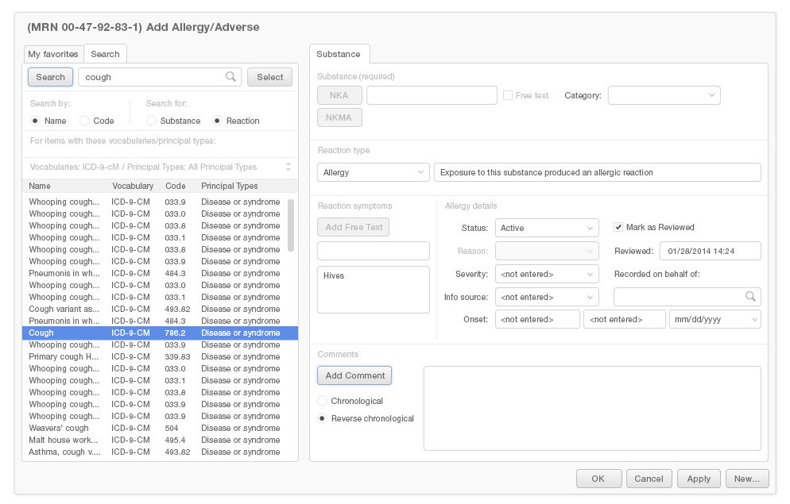

Figure 4.9 **After: Simplified Dialog Requires Only Key Details**— Removes less important information to a box in the lower screen.

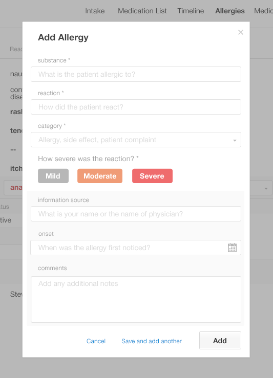

 “after”后一种例子看起来更加直接，但是否与前一种例子一样安全呢？让我们具体看一些设计的细节。

  example looks more straightforward, but is it as safe as the “before” example? Let’s look at the design details.

在下面的截图中([Figure 4.10](#fig-4-10))，对于添加药物到过敏列表中的任务，只有加亮的部分才是必要的。没有加亮的信息是可选的，但医生
要完成这项任务仍需要查看、评估和忽略的。这些不必要的信息会压垮医生，导致[信息过载](./human-factors.php#info_chaos).

In the following screenshot ([Figure 4.10](#fig-4-10)), only the highlighted areas are essential to the task of adding a substance to the Allergy List. The information we haven't highlighted is optional, but physicians trying to complete this task still have to look at it, evaluate it, and ignore it. This unnecessary information overwhelms the physician, leading to[information overload](./human-factors.php#info_chaos).

Figure 4.10 **Before: Essential Data Elements Are Highlighted for Adding a Drug Allergy**

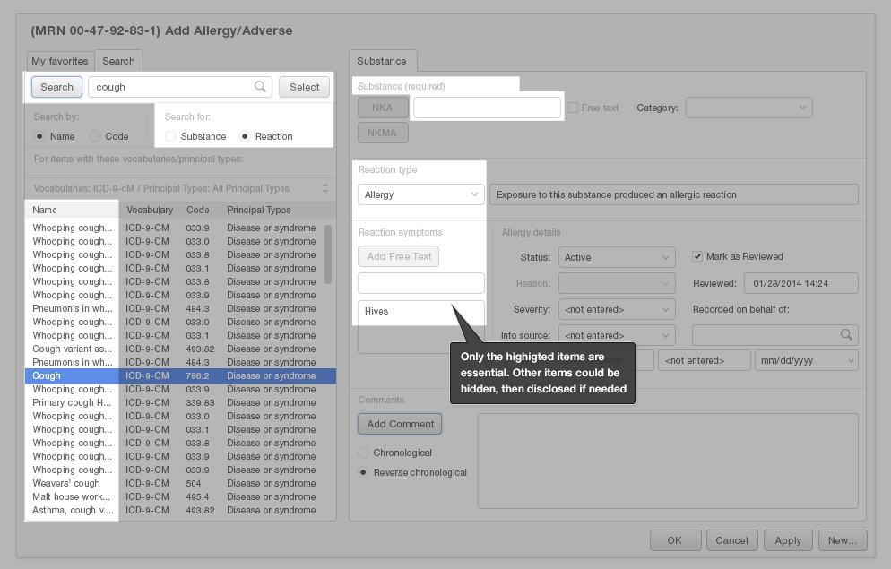

Figure 4.11 **After: Simple, Sequential Design for Adding a Drug Allergy**

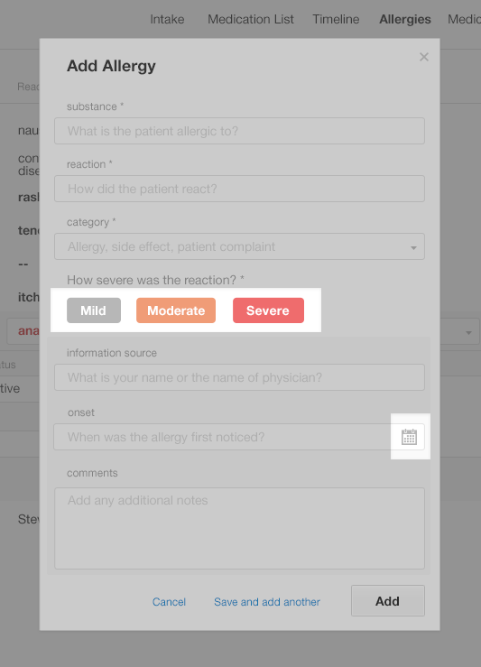

我们提供的后一种例子仅包含必要的数据字段。底部的阴影部分能够让医生输入一些额外的信息。后一种设计示例诠释了[最省力原则](./human-factors.php#how-people-perceive)

Our "after" example (Figure 4.11) only includes the necessary data fields. The shaded section at the bottom offers physicians the ability to enter optional details. Our "after" design exemplifies the[principle of least effort](./human-factors.php#how-people-perceive).

#### 4.4.2 添加信息到过敏列表

当添加新的条目到过敏列表中，护士和医生可能会：
1.  从可能的选择项中找到药物、物品的名称
2.  从可能的选择项中选择描述患者不良反应的症状
3.  如果需要的话，添加其他诸如不良反应的类型、起始日期和信息的来源等信息。

When adding new entries to the Allergy Lists, nurses and physicians might:

1.  Find the name of the drug or substance from a list of possible choices.
2.  Find the symptoms that characterized the patient's reaction from a list of symptom choices.
3.  If desired, add additional details such as the type of reaction, the dates it occurred on, the source of this information, etc.

对比一下两种添加新的过敏到列表中的情况 ([Gallery 4.1](#gal-4-1)):

Compare two examples of ways to add new allergies to lists below ([Gallery 4.1](#gal-4-1)):

Gallery 4.1 **Make It Simple to Add New Allergies**

*  4.1 a  Before: First, Find the Name of the Drug or Substance

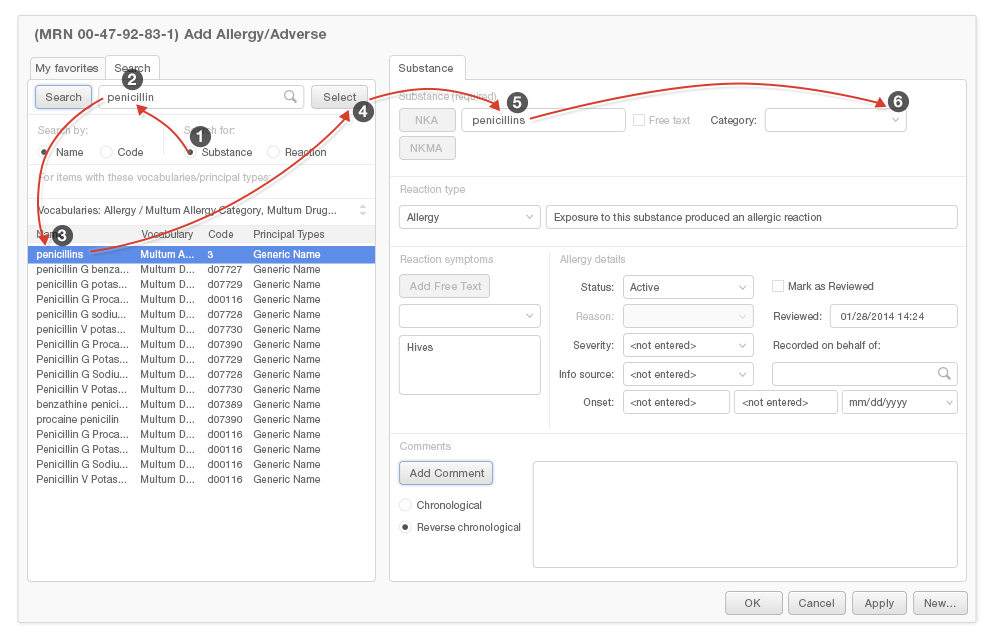

*  4.1 b Before: Next, Add the Reaction Symptoms

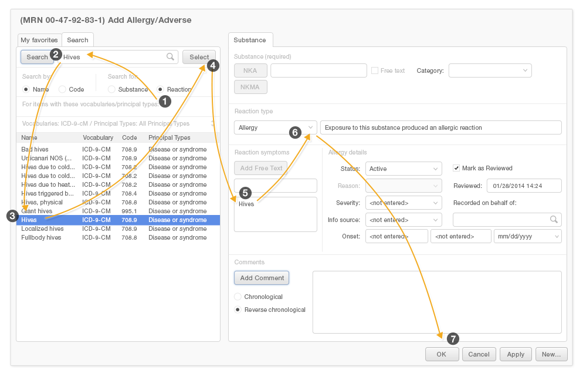

*  4.1 c After: Simplified Visual Path with Fewer Fields when Adding Allergies

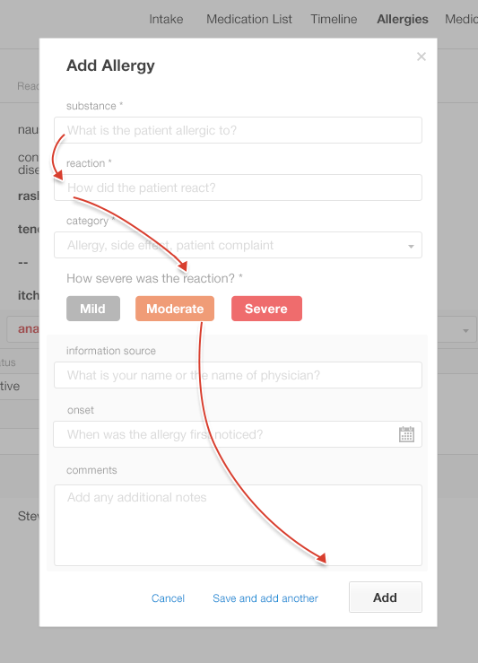

第三种简化版的设计 (see[Gallery 4.1 c](#gal-4-1-c))最易于使用。它有明确的视觉序列，更容易导航，从而更容易完成。

The simplified example's design (see[Gallery 4.1 c](#gal-4-1-c)) can be faster and easier to use. It has a clear visual sequence, which makes it easier to navigate and thus more likely to be completed.

#### 4.4.3 预测性的查询字段

预测性的查询字段能大幅地降低脑力劳动，减少医生录入新的过敏条目时耗费的时间。在预测性的查询结果列表的最上方提供最可能的结果选项能够让用户更容易的找到他们所需的内容。
用户更多地想要输入简单的描述如咳嗽而非较为详细的结果如百日咳或吸烟者的咳嗽。

Predictive search fields can substantially reduce the mental effort and time it takes physicians to add entries to an Allergy List. Pushing the most likely results to the top of the list of predictive search results will make it easier for users to find what they're looking for. Users are far more likely to want to enter a simple description, like "cough," than they are to want to enter a more detailed result, such as "whooping cough" or "smoker's cough."

Figure 4.12 **Before: Searching Symptoms to Add a New Allergy**— The search result listing shows the primary term, "cough," far down a visually busy list.

Figure 4.13 **After: Searching Symptoms to Add a New Allergy**— List displays fewer results and pushes simpler, more frequently-chosen results to the top.

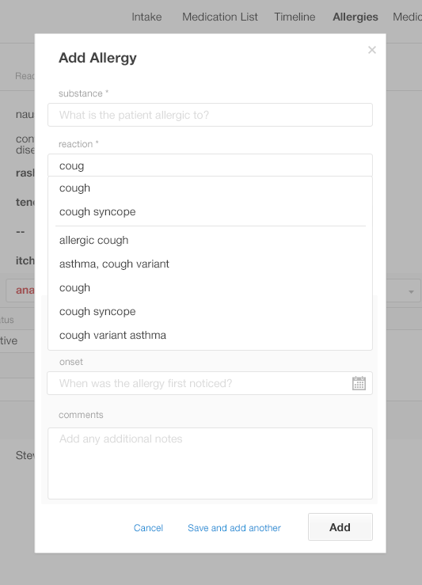

如大家所见，在前一种例子([Figure 4.12](fig-4-12))中很难找到术语“咳嗽”，“咳嗽”出现在列表中的三分之一的位置，和其他术语混淆在一起。

As you can see, it is difficult to find the simple term "cough" in our "before" example ([Figure 4.12](fig-4-12)). The term is about a third of the way down the list, buried among many other terms.

在后一种例子 ([Figure 4.13](fig-4-13))中，最简单的咳嗽位于列表的最上面。其他选项是按照字母顺序排列的。
In our "after" example ([Figure 4.13](fig-4-13)), the simple cough is at the top of the list. Other options are listed alphabetically further down the list, after a visual break.

### 4.5 总结

1.  考虑用户和用户的任务，这能够帮助你决定在特定的过敏列表视图中保留哪些细节和功能
2.  通过医生用来录入过敏信息的表单形成明确的、整齐的导航路径，
3.  在用户要完成某项任务时，去除不必要的细节和大量的阅读来降低信息的混乱
4.  通过预测性的查询功能来降低认知负载，减少失误
5.  把添加不良反应的详细信息(诸如症状、日期和严重程度)列为可选项
6.  使得记录患者未有任何已知的药物过敏更加便利
7.  使得纠正之前信息中的错误信息更加容易

1.  Consider the users and their tasks. This will help you decide what details and functions to incorporate in a particular Allergy List view.
2.  Create a clear, uncluttered navigation path through the form physicians use to input allergy information.
3.  Reduce information chaos by eliminating unnecessary details and amount of reading users must do to accomplish the targeted task.
4.  Reduce cognitive load and reduce errors by offering a predictive search function.
5.  Make adding the details of reactions (such as symptoms, dates and severity) optional.
6.  Make recording that a patient has "no known medication allergies" effortless.
7.  Make correcting erroneous information from previous entries easy.

译者注：

1、Allergy 英文作a damaging immune response by the body to a substance, especially pollen, fur, a particular food, or dust, to which it has become hypersensitive.中文普遍译作过敏、不良反应，卫生信息数据元中有过敏源、过敏史、药物不良反应、预防接种后不良反应
这里我们仅作过敏，而adverse drug reactions作药物不良反应

2、the safety net 兜底线、保障网

3、principle of least effort 翻译成中文叫“省力原则”或“最小成本原则” 最小努力原則 http://terms.naer.edu.tw/detail/1679151/
