## 3

## 用药核对 Medication Reconciliation

利用人为因素原则来促进这个困难但重要的任务。

Exploit human factors principles to facilitate this difficult but important task.

* * *

用药核对指的是对两个及两个以上的用药列表进行对比和整合。通常会涉及到患者与医务人员间的谈话，谈话可以出现在任何情况中。本章中，我们会介绍用药核对的使用场景，
在门诊和住院中能够利用到的一些电子病历系统的设计。第一节重点关注**住院部**的一个用药核对的案例。其中描述了一个叫"Twinlist"的系统原型，介绍了在患者出院过程中是如何使用这个软件的。
第二节重点关注**门诊部**的一个用药核对的案例，重点在于患者在每次就诊开始的时候注释和纠正电子病历系统中用药列表的作用。

Medication reconciliation is the comparison and combining of two or more medication lists. It usually involves a conversation between the patient and a health care professional, and can occur in many different situations. In this chapter, we will explore medication reconciliation scenarios and EHR designs that might be facilitated in inpatient and ambulatory settings. The first section focuses on one example of medication reconciliation in an**inpatient** setting. It describes a functional prototype called “Twinlist” and illustrates how Twinlist could be used when a patient is being discharged from the hospital. The second section focuses on medication reconciliation in the**ambulatory** setting, and focuses on the patient's role in annotating and correcting their EHR medication list at the very beginning of visits.

* * *

### 3.1 住院部的用药核对 Inpatient Medication Reconciliation

考虑住院病人的临床场景：
Consider this inpatient clinical scenario:

#### 住院病人的临床场景：—胸痛患者办理出院 Inpatient Clinical Scenario — A Patient with Chest Pain Is Discharged from the Hospital

现年74岁的Jone琼斯先生是一名商人，业已退休。一直以来在接受冠状动脉疾病(70岁的时候做了支架手术)、便秘、糖尿病、高血压、高脂血症、胃食管反流病和轻微的痴呆
的治疗。琼斯先生由于呼吸不畅，并且在揉自己的胸口，在老伴的坚持下，由他的全科医生，Dr Barnes巴恩斯医生，于周一早上送到医院，琼斯先生在病发的前一晚晚上之前
状态一直不错。他的老伴称周六下午的时候还好好的，两个儿子还和他一起看了比赛。有热狗、有泡菜，搞得跟party一样。

Mr. Jones is a 74-year-old, married businessman, now retired. He’s being treated for coronary artery disease (he received a stent at age 70), constipation, diabetes, hyperlipidemia, GERD, hypertension, and mild dementia. His primary care physician, Dr. Barnes, sent Mr. Jones to the hospital Monday morning after his wife insisted he go to the clinic because he was having trouble breathing and was rubbing his chest. He had been doing fine until sometime the previous night. His wife said he had seemed quite well Sunday afternoon, when two of their sons came over to watch the game with him. They made it “a little tailgate party, hot dogs with sauerkraut and everything."

在检查了琼斯先生之后，医院的医生发现有中度的肺充血，但EKG没有变化。肌钙蛋白检测呈阴性，由于既往病史和家族中存在心肌梗死的历史，琼斯先生被收治入院。
到了周三下午，琼斯先生准备离开而且也可以出院了。medical house officers 之一办理琼斯先生的出院手续，在这个过程中，需要核对用药。

Examining Mr. Jones, the hospital physician found moderate pulmonary congestion, but no EKG changes. He tested negative for Troponin. Because of his past medical history and the strong history of Myocardial infarction (MI) in his family, he was admitted and treated. By Wednesday afternoon, Mr. Jones is ready to leave and can be discharged from the hospital. One of the medical house officers is discharging Mr. Jones and as part of this process, reconciling his medications.

#### 3.1.1 用药核对的系统原型 A Prototype for Medication Reconciliation

在这个场景下，负责办理患者出院的医生要对比2个用药列表：
1.  患者居家时服用的药物列表(在入院时由intake nurse 记录的，或者直接从其他的EHR系统中获取的)
2.  患者从入院到最后一天的用药列表

In this scenario, the physician discharging the patient has to actively compare two lists:

1.  The list of medications the patient was taking at home (e.g. recorded by an intake nurse when the patient arrived at the hospital, or obtained from a different EHR system)
2.  The list of medications on the last day of the patient’s hospital stay

对比过后，这位医生要决定哪些药物在出院之后要继续服用，哪些药物要停用。
Our physician will then decide which medications could be continued after the patient is discharged and which should be stopped.

让我们通过一个短片来了解这个叫“Twinlist”的系统原型。
Let’s watch a short video about a prototype called “Twinlist,” an award-winning demonstration of a proposed medication interface.

[观看TwinList的演示视频](http://www.youtube.com/watch?v=YXkq9hQppOw&feature=youtu.be)

如果你想要了解Twinlist的更多内容，请试一试这个交互式原型系统：

If you’d like to explore Twinlist in more detail, try the interactive prototype:

[试一试!](http://www.cs.umd.edu/hcil/sharp/twinlist/dev/indev/ipad/index.html?case=__DATASET_APPENDECTOMY__&version=__VERSION_FULL__&animate=__AUTO_ANIMATE_ON__)

>#### 了解更多

>要了解更多Twinlist内容，请访问网站[Twinlist project on the University of Maryland website](http://www.cs.umd.edu/hcil/sharp/twinlist/)。你会发现更多演示高级功能和设计的视频。你也可以试试[大数据量下的Twinlist](http://tinyurl.com/k5b4kmx).

>To learn more about Twinlist, visit the[Twinlist project on the University of Maryland website](http://www.cs.umd.edu/hcil/sharp/twinlist/). You will find additional videos there that demonstrate advanced features and design variants. You can also experiment using[Twinlist with larger datasets](http://tinyurl.com/k5b4kmx).

下面是一些使得Twinlist成为一个高效交互界面的特性：
1.  [空间分组 Spatial grouping](./human-factors.php#gestalts)(参考人为因素章节中的 Gestalts ):事物越接近就越相似
2.  动画: 用户能够快速学会如何对药物进行分组
3.  高亮: 轻易捕捉到关键性差异，帮助做出决策
4.  快速选择：罗列药品信息的最大的矩形按钮很容易点击。

Here are some of Twinlist’s features that make it an effective interface:

1.  [Spatial grouping](./human-factors.php#gestalts) (See Gestalts in the Human Factors chapter): The closer things are, the more alike they are.
2.  Animation: Users can quickly learn how the drugs were grouped.
3.  Highlighting: Key differences are visible and facilitate decision-making.
4.  Rapid selection: The largest rectangular buttons that list drug information are easy to click.

我们浏览一下 Twinlist ([Figure 3.1](#fig-3-1) to[3.5](#fig-3-5))的图片来回顾一些细节。能够说明出院过程中的用药核对。

Let's look through some individual images of Twinlist ([Figure 3.1](#fig-3-1) to[3.5](#fig-3-5)) to review the details. This illustrates medication reconciliation during hospital discharge.

Figure 3.1 **并排展示的两个列表**— 在 Twinlist 开始匹配类似药物之前

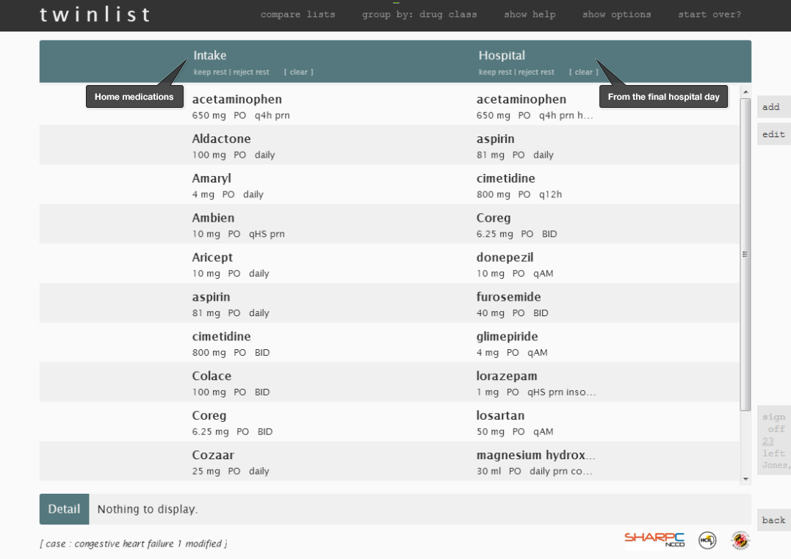

Figure 3.2 **相同的药品居中，不同的药品居左/居右显示 **— 类似的药品 (e.g. Aricept and donepezil)对齐显示，其中类似药品的不同之处用黄色高亮显示

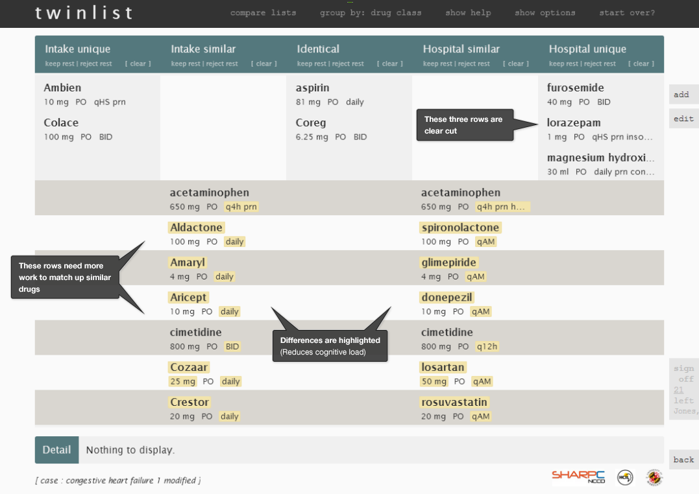

Figure 3.3 **鼠标停留在药品上**— (Amaryl)药品的背景呈暗色高亮显示，与之类似的药品也被高亮显示(glimepiride).药品的其他详细信息则展示在屏幕的最下面。

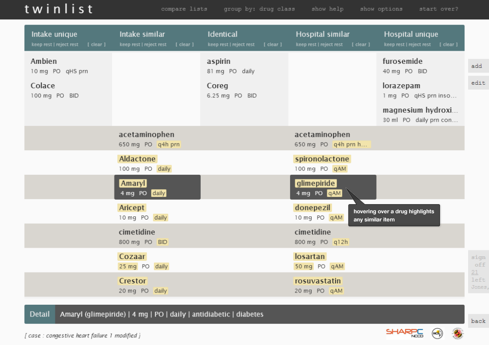

Figure 3.4 **鼠标点击药品，选择药品则表示该药品应该在出院后继续服用**— 药品的背景色变为绿色。再次点击(或者右键点击)则取消选择，表示停用该药物。停用的药物呈灰色。类似的药物自动地取消选择(
比如glimepiride)。可以在诸如iPad等触屏设备上使用滑动手势。

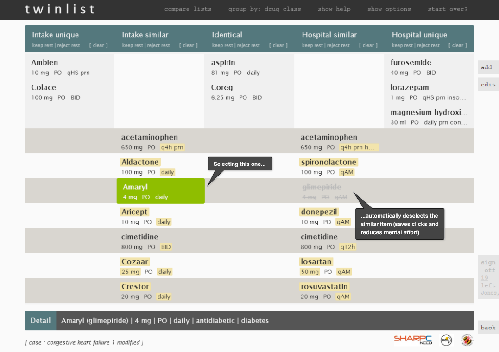

Figure 3.5 **最终的待审核的整合过的用药列表**— 查看所有[亮绿色](./design-principles.php#dark-side-of-color) (See The Dark Side of Color in the Design Principles chapter)的已选中药物，可以很明显地看出该药物来自哪个列表。

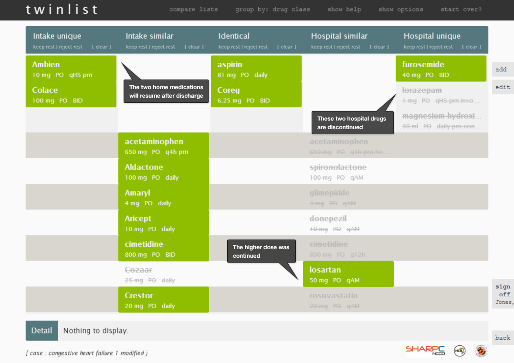

#### 3.1.2 Twinlist 中用到的人为因素原则 Human Factors Principles Used in Twinlist

Twinlist 系统原型中使用了大量的人为因素原则来使其高效、安全：
1.  通过数据预处理来确定类似的药物.
    1.  使用一种算法来匹配‘相同’的药物并合并这些药物，这样减少了医生的认知负载.
    2.  使用一种算法来匹配'类似'的药物并在同一行中对齐，这样能够减少对两个列表的重复浏览.
    3.  ‘唯一的’药物只出现在一列之中，并且靠边显示.
2.  该系统利用了人类大脑处理信息的方式(尤其是 “[前注意属性 preattentive attributes](./human-factors.php#preattentive-attributes)”) (See Preattentive Attributes in the Human Factors chapter)来对类似的项进行空间分组.
    1.  这样的[空间分组 spatial groupings](./human-factors.php#gestalts)(See Gestalts in the Human Factors chapter) 能够让医生快速的确定药物的关键分组(哪些是相同的、哪些是相似的，哪些是唯一的).两种药物差异越大，二者水平显示的距离越远。相同的药物则处于中间位置.
    2.  类似但不是相同的药物之间的差异使用金黄色来高亮显示，减少了医生重复的浏览、阅读和比较列表项的工作.
3.  动画能够帮助用户快速学习并了解药物的分组。随着用户越来越熟悉该系统，可以跳过或关闭动画.
    1.  让列表更紧凑的显示能够帮助节省垂直空间。需要医生多加思考如何整合的类似但不是相同的药物显示在屏幕的相对下面的位置
    2.  相同的药物成对显示在图表的最中间，这样视觉上来看就是最完美的匹配.
4.  医生可以通过与界面的一些交互来获取给你更多关系.
    1.  鼠标移到药物上面会在屏幕下方显示更多药物的详细信息，比如药物类型或适应症。同时，也会高亮显示类似的药物。点选类似但不相同组中的药物会排除其他的药物.
    2.  菜单的功能允许用户同时对多个药物进行操作.
    3.  通过点击药物，用户可以随意地从接受、拒绝或未确定状态之间变化或变更他们的决定。
5.  界面中保留了用户需要用以决策的信息并最小化了用户需要记忆屏幕之外信息的需要。

The Twinlist prototype uses a number of human factors principles to make it efficient and safe:

1.  Identifying similar drugs is facilitated by preprocessing the data.
    1.  An algorithm matches ‘identical’ medications and merges them, thus reducing the physician’s mental effort (cognitive load).
    2.  An algorithm matches ‘similar’ medications and aligns them on the same horizontal row. This reduces the need for repetitive visual scanning of the two lists.
    3.  ‘Unique’ medications appear in only one column and move to the perimeter of the display.
2.  The prototype takes advantage of the way the human brain processes information (specifically “[preattentive attributes](./human-factors.php#preattentive-attributes)”) (See Preattentive Attributes in the Human Factors chapter) by spatially grouping like items together.
    1.  These[spatial groupings](./human-factors.php#gestalts)(See Gestalts in the Human Factors chapter) allow physicians to quickly identify the key groups of medications (those which are identical, similar, and unique). The more different two drugs are, the farther apart they appear horizontally. Identical drugs are in the center.
    2.  Differences between similar but non-identical medications are highlighted in golden-yellow, which reduces the need for physicians to repeatedly scan, read, and compare the list items.
3.  The animation helps users quickly learn and understand the groupings of drugs. As the user grows familiar with the tool, the animation can be sped up or turned off.
    1.  Making the list compact helps save vertical space. Similar but non-identical drugs, which physicians may have to think harder about how to reconcile, are together in the lower section of the screen.
    2.  Identical drug pairs merge into the center of the chart and are thus visually identified as perfect matches.
4.  Physicians can interact with the interface to discover more relationships.
    1.  Hovering over a drug displays more details about the drug at the bottom of the screen, such as drug class or indication (i.e. the problem being treated). It also highlights similar drugs. Clicking to select a drug in a “similar but not identical” group rejects the others.
    2.  The menu functions in a way that allows users to take actions on multiple drugs at the same time.
    3.  Users can easily change or reverse their decision by clicking on drugs to toggle them through accepted, rejected, or undecided states.
5.  The interface keeps the information users need to make decisions visible and minimizes the need for users to rely on their ability to recall off-screen information.

#### 3.1.3 其他考虑因素 Other Considerations

住院过程中的用药核对同时也会涉及到新增药物、电子处方和生成病历文档。其中涉及了入院时和出院时患者和医护人员的对话，。为了
成功的核对住院病人的用药列表，医生必须了解药物管理的两个方面：

1.  用药
    1.  在过去的几天里给患者开了多少insulin and analgesics?
    2.  患者使用了所有的剂量，还是其中一些剂量被推迟了或并没有使用?
    3.  患者是否使用了任何一种 PRN(必要的时候才给病人吃,不是定期吃的) 剂量 (i.e. 比如在病情恶化时使用的)? 服用了多大剂量?
2.  临床评估
    1.  由于患者即将离开医院，静脉注射的药物需要转换成口服用药。患者是否能够忍受口服的药物?
    2.  口服用药的初始剂量应该是多大?
    3.  患者离开医院之后多久之后需要调整剂量，谁来负责调整剂量?
    4.  患者是否能够承受必要的药物的价格？保险是否包括该药物？

Inpatient medication reconciliation also involves adding new drugs, e-prescribing, and generating documentation. It involves conversations with the patient and caregivers, at the time of admission and again at the time of discharge. To successfully reconcile inpatient medication lists, physicians must understand two aspects of medication management:

1.  Medication administration
    1.  How much insulin and analgesics were prescribed to this patient in the last few days?
    2.  Did the patient receive all the doses, or were some doses delayed or not administered?
    3.  Did the patient receive any PRN doses (i.e. administered as the situation arises)? How many doses were given?
2.  Clinical assessment
    1.  Since the patient will be leaving the hospital, intravenous medications need to be switched to oral versions. Will the patient be able to tolerate the oral version?
    2.  What should the starting dose of that medication be as the oral version?
    3.  How soon after the patient leaves the hospital will the doses need to be adjusted, and who will adjust them?
    4.  Can the patient afford the needed medications? Will the insurance cover the medications?

医生通常比较关心从一个科室转诊到另一个科室的患者。在一次就诊过程中，
患者可能会转移多次-比如从急诊室到普通的护理病区，ICU， step-down unit到再到普通护理病区。
特别严重的住院患者可能无法自己口服药物，可能需要在ICU静脉注射一些药物。随着患者慢慢康复，患者服用的药物剂量会减少，在整个住院过程中会逐渐变化。在患者出院后，他们可能需要开始服用居家药物，其中一些可能需要调整剂量，患者也可能需要其他一些药物。

Physicians commonly care for patients who have moved from one unit to another. A patient might even move several times during the course of one visit —for example, from the emergency room to a general nursing unit, intensive care unit, step-down unit, and back to general nursing unit again. Critically ill inpatients may be unable to take their medications orally and may be receiving several medications intravenously in the intensive care unit. As patients begin to recover, they might resume their previous medications at reduced doses which may gradually change throughout their hospital stay. When patients are discharged from the hospital, they may need to resume taking home medications, some of which may need dosage adjustments, and patients may need to take some additional medications.

* * *

### 3.2 门诊用药核对 Ambulatory Medication Reconciliation

在门诊部医生对两种用药列表进行整合：

1.  电子病历系统中记录的用药列表
2.  患者自称的实际上服用的用药列表

Physicians use two medication lists to reconcile medications in an ambulatory setting:

1.  What it says in the EHR
2.  What the patients report they actually take

医疗团队的成员能够通过患者访谈或者让患者填写表格的方式来采集患者用药依从性的信息。
填写表格的方式可能会节约办公室职工的时间。下图显示了门诊部用药核对的简化的工作流程。

Healthcare team members can collect information about patients’ adherence to their medication regimens either by interviewing the patients or by giving the patients a form to fill out. The latter option may save the office staff time. The diagram below shows a simplified workflow for medication reconciliation in the outpatient setting.

Figure 3.6 **门诊部简化的用药核对工作流程**

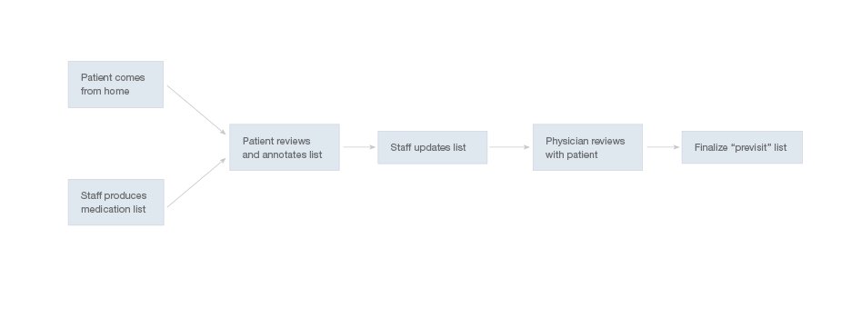

不同诊所的用药核对流程各异，取决于不同诊所分配给员工的角色。在某些诊所，护士与患者面谈患者
，更新用药列表，必要时对患者的用药依从性进行批注。随后医生确认与患者相关的批注，对不确定的细节进行确认。其他诊
所则直接把电子病历系统中的当前用药列表打印出来，让用户自己来批注，
医生在患者来访时对用药列表进行复审。

The medication reconciliation workflow may vary from clinic to clinic, depending on what roles said clinic assigns various members of its staff. In some clinics, nurses interview patients and update the medication list, adding annotations about patients’ adherence where necessary. Physicians subsequently confirm these annotations with the patients and seek clarification about any uncertain details. Other clinics give patients printouts of their current medication list as recorded in the EHR, which the patients can then annotate. In other clinics, physicians review medication lists with the patients in the course of their visits.

某些专科医生尤其是外科医生，可能不会那么严格的复审用药列表，只关注那些他们所下达的药品医嘱，
比如术后抗生素或止痛药物。这些专科医生不必考虑对整个用药列表负责的前提下
对他们负责的药物进行reconcile。核对界面可能会提供一种方式来表示专科医生已经完成了自己应负责的那部分药物的核对。可能通过让用户点选除了“核对并签字”之外的选项，如"已确认"或“已复核但未批准”。

Some specialists, particularly those in surgical subfields, may review medication lists less precisely, focusing only on the medications they have prescribed, such as post-operative antibiotics or pain medications. These specialists need to be able to reconcile the medications they’re responsible for without assuming responsibility for the entire medication list. Reconciliation interfaces might offer a means of conveying that specialists have reconciled the medications they’re responsible for, and only those medications. It might be accomplished by giving users the option of clicking on ‘Acknowledged’ or ‘Reviewed but not approved’ in addition to the fuller ‘Reconcile & Sign.’

在门诊过程中，患者和医生对接下来新的治疗方案达成一致。医生可能会开一些下一些处方，
对原来的用药列表做一些调整，然后患者可以把更新后的用药列表的副本带回来。

During the visits, patients and physicians agree upon new plans of action. Physicians might then prescribe and makes other changes in the medication list. Patients then get updated copies of their list to take home.

#### 门诊临床场景——长期胸痛的患者称其他医生调整了自己的用药列表
Ambulatory Clinical Scenario — Patient with Chronic Pain Reports Changes Other Physicians Have Made to Her Medication List

Stanton太太是一位高中教师，在一次摩托车事故中严重受伤。一名骨科医生和她的全科医生
以及一名疼痛管理方面的专科医生一起负责她的诊疗。今天在看了她的全科医生Dr Barnes之后，Dr Barnes对她的用药列表做了一些调整。

Mrs. Stanton is a high school teacher who was seriously injured in a motor vehicle accident. Mrs. Stanton is under the care of an orthopedic surgeon and a pain management specialist as well as her primary care doctor. Today's visit with Dr. Barnes, her primary care doctor, involves several changes in her medication list.

在问诊开始的时候，Stanton太太拿到了她的全科医生这边记录的她的用药列表。她留意到上面的信息不是最新的。其中并没有记录她的疼痛管理专科医生最近给她新开的药物，nortriptyline，并停用了 hydrocodone-acetaminophen而且
她的骨科医生增大了Celebrex的剂量。Stanton太太要指出用药列表的这三处变化。

At the beginning of the visit Mrs. Stanton receives the medication list her primary doctor has on file for her. She notices it’s not quite up to date. It does not record that her pain specialist recently started her on a new medication, nortriptyline, and stopped another one, hydrocodone-acetaminophen, or that her orthopedic surgeon increased her dose of Celebrex. Mrs. Stanton needs to indicate those three changes on the list.

#### 3.2.1 患者复查用药列表 The Patient Reviews the Medication List

上面的应用场景中患者提到的三处不一致是门诊部、全科科室中患者复查用药列表时患者所标注出的
常见类型的问题。为了保证电子病历系统的安全、高效的临床决策支持，需要有一个保持最新的用药列表。

The three discrepancies the patient noted in the above scenario are typical of the type of problems patients flag when reviewing their medication lists in ambulatory, primary care settings. For the EHR to offer safe, effective clinical support (e.g. drug alerts and decision support), it needs to work with an up-to-date medication list.

随后你可以看到一个简单的界面，能够让患者使用平板或台式机来复审和更新他们的用药列表。每个屏幕只显示一种药物和具体的药品信息，
(规格和剂量说明)。患者可以谨慎地回答每个药物相应的问题。然后，患者可以整体性的复核用药列表。患者可以添加新的药物，
添加一些批注和疑问。如果患者知道哪种药物需要重新拿药，他们也可以指出来。

Below, you’ll find a design for a simple interface that allows patients to review and update their lists using tablets or desktop computers. Each screen shows only one medication, with its associated details (strength and dosage instructions). This allows the patient to answer questions carefully for each drug. Afterwards, patients can review the list as a whole. They can add drugs and include comments or questions. If the patient knows which of their medications need to be renewed, they can also indicate that.

如下的一系列图展示了一个简单是示例，用于说明患者在门诊过程中复核自己用药列表的过程。

We offer a design example with the following series of images (Figures[3.7](#fig-3-7) to[3.12](#fig-3-12)), illustrating a patient reviewing her medication list for a physician visit.

Figure 3.7 **界面中每次只显示一种患者用药列表中的药物——只有不多的几个可标记的选项**—这种展现方式很适合触屏界面。进度条说明了用药列表中有多少种药物(能够帮助用户了解[flow state](./human-factors.php#flow-state))

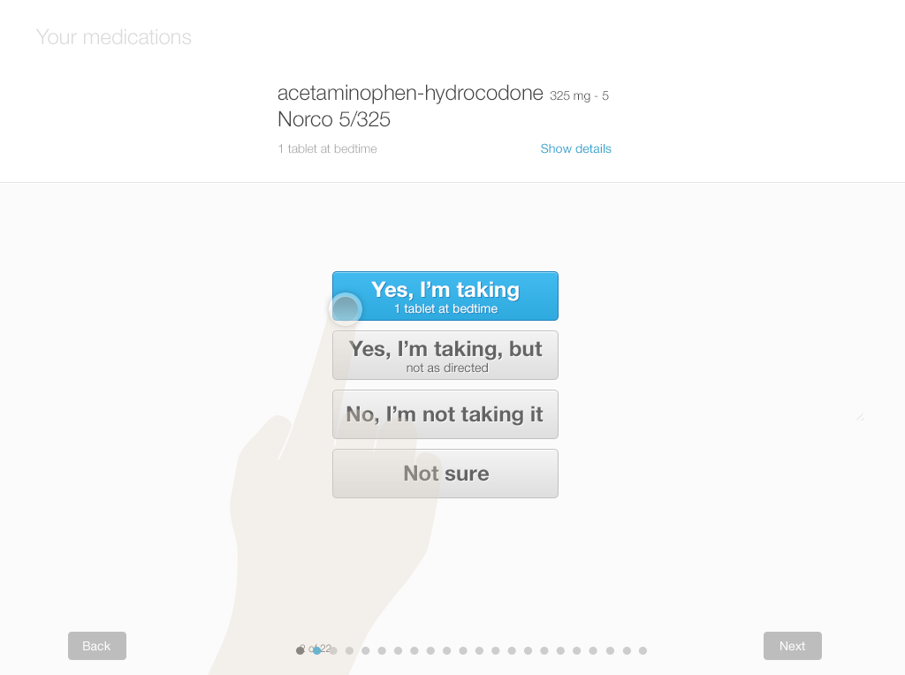

Figure 3.8 **出于多种原因， 患者可能并没有服用某种药物**— 医生下达了处方，但患者接收不了这种药物，并没有去拿药等

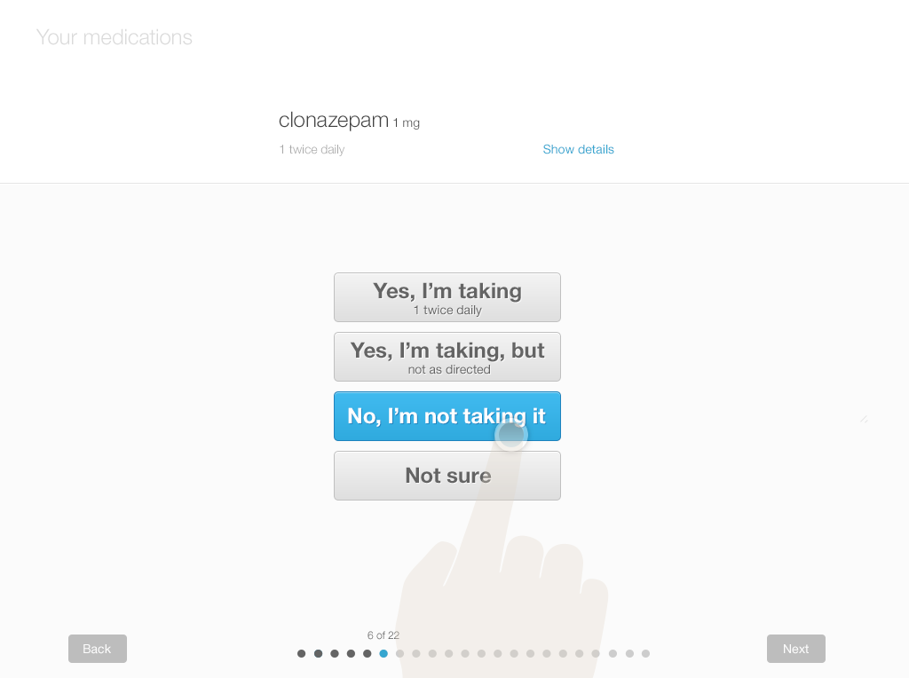

Figure 3.9 **“在服药，但没有按照要求的服用”**— 这种回答足以促使医生和患者之间就依从性进行沟通

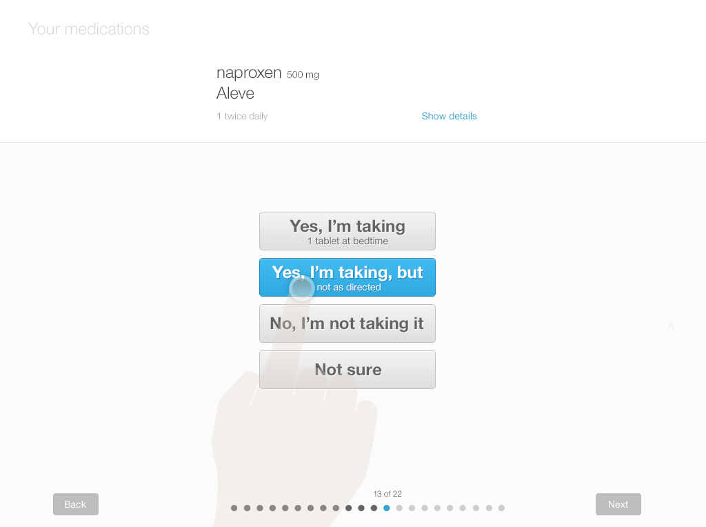

Figure 3.10 **患者对某种药物表示不太确定.**— 可能没有认出来药物名称，可能不清楚具体的剂量，或者可能对其他内容不太确定

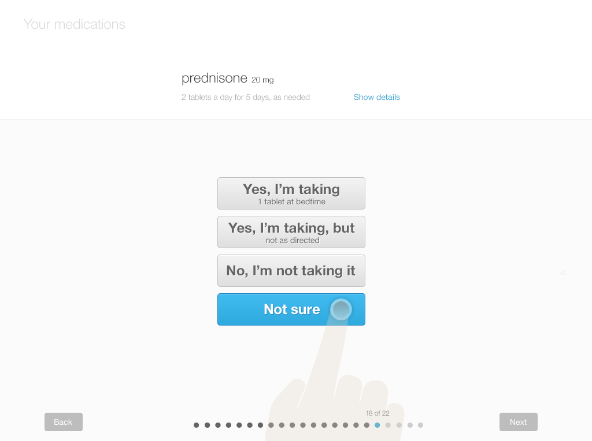

Figure 3.11 **患者已经复核了所有的药物**— 这个选项提示患者添加缺失的药物。同时也提醒患者添加正在服用的其他药物。界面中
允许使用模糊的错误的拼写，在患者输入的时候会推荐一些可能的药物名称。

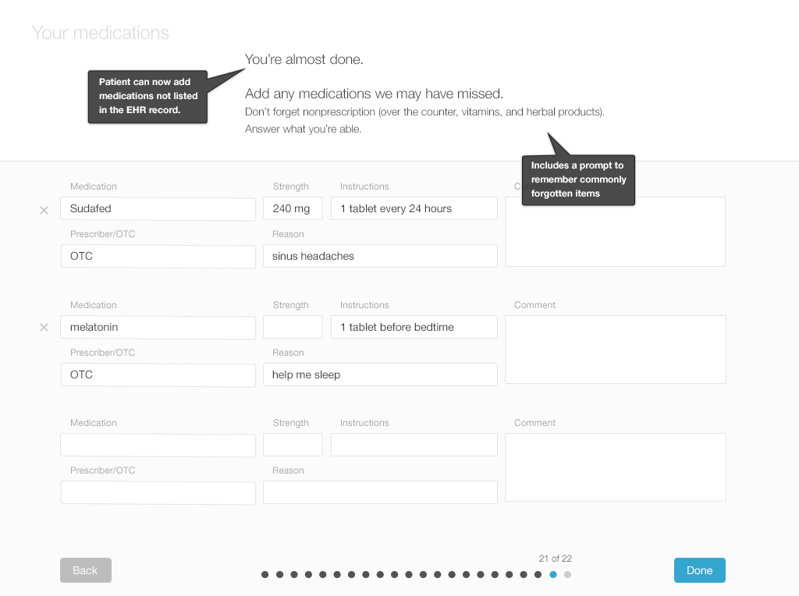

Figure 3.12 **从患者的角度对用药列表的最终复核**— 患者可以对整个用药列表进行复核，对需要医生续的药物进行标记和评论。

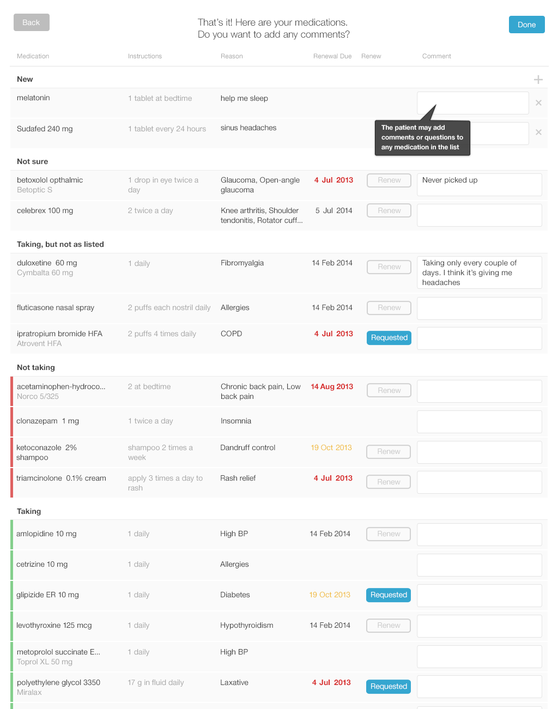

在患者对整个用药列表复核之后，医生必须审核被标注过的用药列表。对于其中有异议和不确定的地方应该通过沟通来解决。最后把curated details的内容添加到患者的病历中去。

After the patient has reviewed the medication list, the physician must review the patient’s annotated list. They’ll have a conversation about any discrepancies and uncertainties in an effort to resolve them. Then those curated details would be added to the patient's record.

>#### 挑战——用药的依从性 Challenge - Medication Adherence

>**获取依从性的相关信息 The Capture of Adherence Information**
有2种主要的方式可以获取患者用药依从性的相关信息。其中之一是询问患者来提供信息，另一种是
从电子处方的系统网络中跟踪患者配药的信息。这种情况下，并非所有的药房、pharmacy benefit managers、
保险与电子处方的系统网络是打通的，但即使是不完整的数据库也能够补充患者自己上报的信息，帮助
医生得到一个更加精确的患者依从性的视图。

>There are two main ways to capture information about patients' medication adherence (or lack thereof). One is to ask patients to provide the information, and the other is to track information about prescription fills from the e-prescribing network. At the moment, not all pharmacies, pharmacy benefit managers, and insurance plans are linked with e-prescribing networks, but even incomplete databases can complement patients’ reports and help draw more accurate pictures of patients’ adherence patterns.

>**不依从是很常见的 Non-Adherence Is Widespread**
>很多患者从不根据处方配药。在发达国家，50%患有慢病的患者会忘了配药1。
通常患者会夸大自己的依从性程度。建议医生使用不那么带有评价意味的言语。系统界面也要使用类似的言语来鼓励患者给出准确的答案。
用药核对的流程旨在发现真实情况，这样患者和医生才能够互相合作调整各自的目的，最终拿出一个双方都能够接受的诊疗计划。

>A significant number of patients never fill their prescriptions. In developed countries, an average of 50% of patients with chronic diseases neglect to do so1. Patients commonly over-report their degree of adherence, as well. Physicians are encouraged to use language that is non-judgmental. User interfaces can use similar language as well, to encourage patients to give accurate answers. The medication reconciliation process aims to uncover the truth, and from there to allow the patients and physicians to collaboratively align their goals and come up with a plan of care that both parties can get behind.

>#### 患者停止服用的原因是什么 Why Patients Stop Taking Their Medication

>为什么患者会不服用处方中的药物？他们可能只是从来不配药。有时候配了药也不服用。其他情况下会服用一段时间，然后停止服用。
如下是患者不依从性的一些常见理由：

>1.  由于药价太贵患者没有购买此药
>2.  在有了副作用之后患者停止服用此药
>3.  药物的副作用超过了好处
>4.  患者担心会有副作用
>5.  患者没有从药物中获益
>6.  患者不相信药物能够帮助自己
>7.  患者误解了药物带来的好处
>8.  患者不信任下达处方的医生

>Why don’t people take the medications prescribed for them? They may simply never fill the prescription. Sometimes they fill the prescription but don’t take the medication. On other occasions they take the medication for a while, but then stop. Here are a few common reasons behind patients’ non adherence:

>1.  The patient did not purchase the medication because it was costly.
>2.  The patient stopped taking the medication after experiencing side-effects.
>3.  The medication’s side effects outweighed its benefits.
>4.  The patient was afraid of the side-effects.
>5.  The patient didn’t benefit from the medication.
>6.  The patient didn’t believe the medication would help them.
>7.  The patient misunderstood the expected benefits of the medication.
>8.  The patient didn’t trust the physician who prescribed the medication.

>了解患者不服用药物的原因能够帮助医生做出更好的决策。如果失控的血压是引起不依从性的原因，医生是不会想增加抗血压药物的剂量

>Knowing why patients do not take their medication can help physicians make well informed decisions. The physician doesn’t want to increase a patient’s dose of antihypertensive medication if non-adherence is behind uncontrolled blood pressure.

#### 3.2.2 患者批注用药列表之后，医生审核用药列表

现在让我们来研究一下，在患者批注过用药列表之后，医生审核和整合患者用药列表的流程。可以使用类似于
[Twinlist](http://www.cs.umd.edu/hcil/sharp/twinlist/dev/indev/ipad/index.html?case=__DATASET_APPENDECTOMY__&version=__VERSION_FULL__&animate=__AUTO_ANIMATE_ON__)的界面来展示患者的用药列表，或者医生也可以使用患者用来复核用药列表和添加批注的同一个界面。使用完全不同的界面也是可以的。

Now let’s examine the workflow of physicians as they review and reconcile a patient’s medication list after the patient has annotated it. The patient’s list could be displayed via an interface similar to[Twinlist](http://www.cs.umd.edu/hcil/sharp/twinlist/dev/indev/ipad/index.html?case=__DATASET_APPENDECTOMY__&version=__VERSION_FULL__&animate=__AUTO_ANIMATE_ON__) (http://tinyurl.com/kljlkhs), or the physician can work with whatever single-list interface the patient just used to review the entire list and enter annotations. Entirely different interfaces are also possible.

在有了患者的批注之后，用药列表就可以让医生来进行审核了。下面来了解一下我们设计的一个范例。 ([Figures 3.13](#fig-3-13) to[3.16](#fig-3-16))

The list is ready for the physician to review, with the patient's annotations included. Let's look at our design example. ([Figures 3.13](#fig-3-13) to[3.16](#fig-3-16))

Figure 3.13 **用药列表按照复核时的问题进行排序**— 可操作的项目被归类在一起：可能需要新增药物，患者所说的未服用的药物可能需要调整或移除，患者不确定的药物可能需要进一步讨论等等。
左边红色和绿色的条表示患者到底是在服用还是没有服用某种药物。

Actionable items are grouped together: new medications will probably need to be added, medications the patient reports not taking may need to be adjusted or removed, medications the patient is unsure about will have to be discussed, etc. The red and green bars on the left side show whether the patient is “taking” or “not taking” the specific medications.

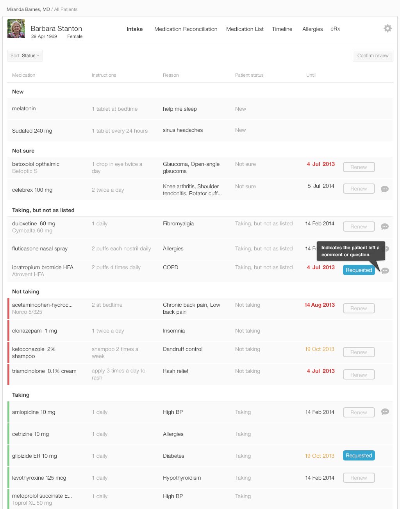

Figure 3.14 **在与患者的谈话过程中医生可以敲定一些细节，编辑评论的部分
The Physician Can Clarify the Details during a Conversation with the Patient, and Then Edit the Comments**

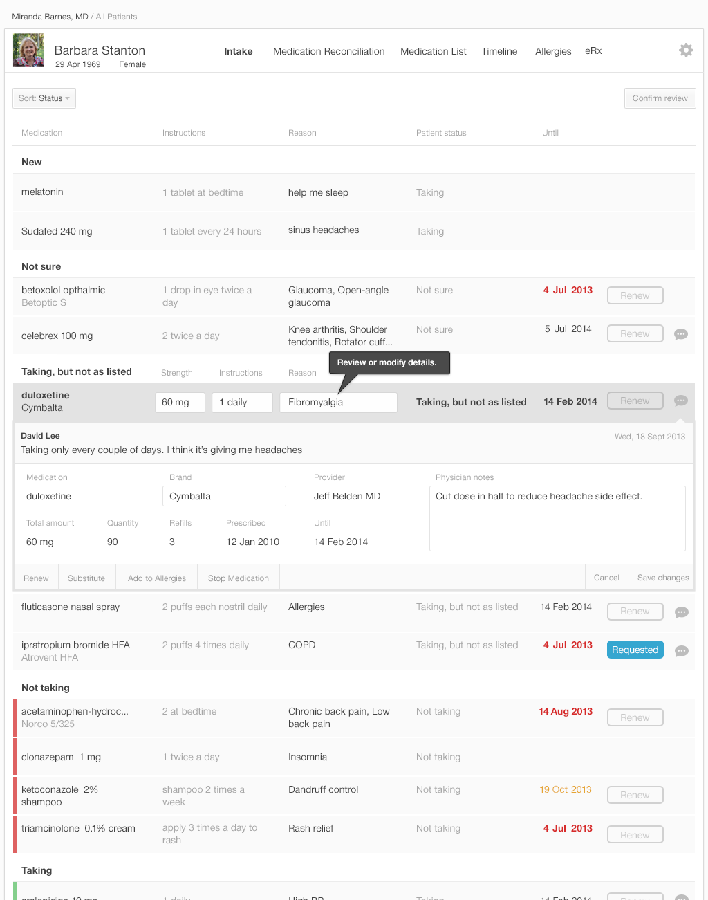

Figure 3.15 **医生可以移动药物 The Physician Can Move Medications**— 可以把药物从一个组移动到另一个组，
要么是拖拉的方式 要么是通过菜单选择的方式。理想情况下，在面谈完成之后，所有药物要么是在"服用"要么是在"停用"类。
在本图中，Celebrex被移动到"服用"类中。

Medications can be moved from one group to another, either with a drag and drop gesture or using menu selections. Ideally, by the end of the interview, all the drugs on the list will have moved into the “taking” or “not taking” category. In this figure, Celebrex has been moved to the “taking” category.

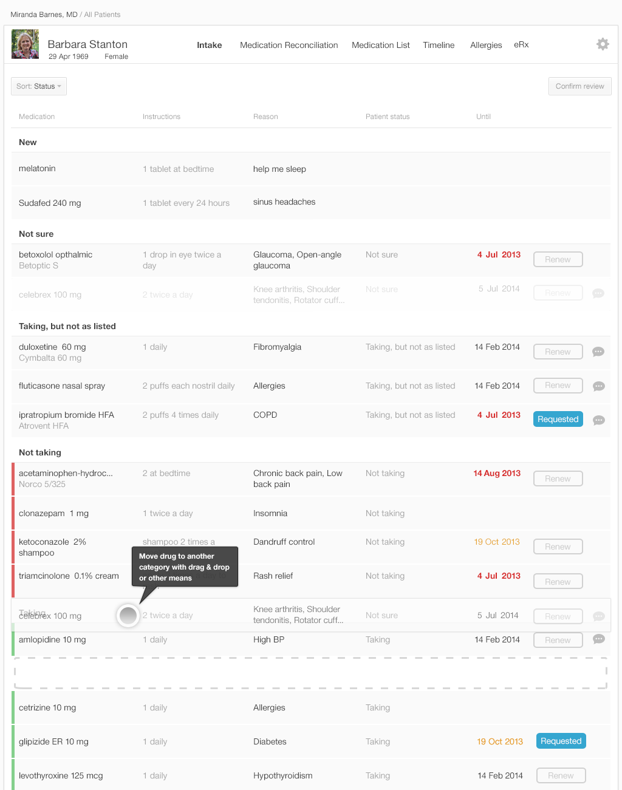

Figure 3.16**医生能够选择确认所有或部分药物的状态
The Physician Has the Option to Confirm the Status of All or Some of the Medications**

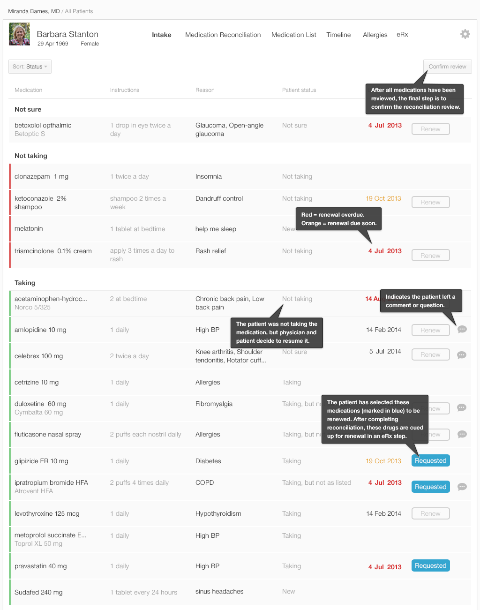

图3.16中的列表就是医生对用药列表的最终审核。一旦医生点击了左上角的"确认评审"按钮，批准了整个用药列表，
电子病历系统则更新患者病历中的用药列表，保存所有依从性相关的批注。用药列表中每个药物所处的分组确定了最终的核对后的用药列表在患者病历中的保存方式。

The list in Figure 3.16 is the physician’s final review of medication list. Once the physician approves the list by pressing the “Confirm Review” button in the upper right, the EHR updates the medication list in the patient’s record and saves all comments about adherence. The category in which a medication has been placed in the list specifies how the final reconciled medication list is saved in the patient’s record.

<table class="sidebar-table" id="patient-adherence"><thead><tr><th>分类</th><th>结果</th></tr></thead><tbody><tr><td>不确定 Not sure</td><td>在核对后的用药列表患者保留该药物，标记为"不确定" Keep the medication in the reconciled list, but mark as “not sure.”</td></tr><tr><td>未服用 Not taking</td><td>从核对后的用药列表中移除该药物 Remove the medication from the reconciled medication list.</td></tr><tr><td>服用中 Taking</td><td>在核对后的用药列表中保留该药物 Keep the medication in the reconciled list.</td></tr><tr><td>服用中Taking (由患者标记为"未服用"或"未按处方要求服用"but annotated as “not taking” or “not taking as prescribed” by the patient)</td><td>保留该药物，在患者病历中保留依从性批注 Keep the medication, but preserve the adherence comments from the patient in the record.</td></tr></tbody></table>

在我们的系统设计中 医生需要学习使用拖拽的功能(或者相应的菜单功能或[affordances](./human-factors.php#expectations))。
(参考Our Eyes Have Expectations in the Human Factors chapter)把药物从一个组移动到另一个组。

In this design physicians would need to learn the drag and drop functionality (or alternate menu functions and[affordances](./human-factors.php#expectations)) (See Our Eyes Have Expectations in the Human Factors chapter) that allow moving medications from one category to another.

门诊开始时完成了用药核对之后，医生会了解更多的患者病史信息，做一些检查，做出临床诊断，与患者一起制定治疗计划。
治疗计划包括了新增药物或调整药物。

After the medication reconciliation at the start of the visit, the physician takes further information about the patient's medical history, does an examination, makes clinical decisions, and collaborates with the patient to make a plan of action. Their plan might include changing or adding to the patient's medications.

>#### 挑战：捕捉和展现不确定性 Challenge: Capturing and Presenting Uncertainty

>对于用药列表，患者常常表示不确定。比如，患者可能认不出或读不出自己服用了一段时间的药物名称。一些人可能用目的来说明药物：“治疗血压的药物”
除了门诊的访谈之外的沟通(电话或邮件等)可能会传达出一些病历中未记录的信息。

>Patients often report uncertainty about their medication list. For instance, patients may not be able to recognize or pronounce the names of medications they've been taking for some time. Some people may refer to medications by intended purposes: "a blood pressure medicine.” Conversations outside the formal office visit (via phone or email) may have conveyed information that didn’t make it to the patient’s record.

>用药核对意味着确定：在记录完成之后，数据就获得了事实的状态。但这种确定性不总是合理的。我们需要
一些方法在与人相关的技术中表示不确定性。电子病历系统可能会通过文本批注或定量指标如置信度或可能性算法来表示不确定性

>Medication reconciliation implies certainty: after it's recorded, the data acquires the status of fact. That certainty is not always justified. We need methods to represent uncertainty in these human aspects of technology. An EHR might represent uncertainty by including text comments or with quantitative measures such as confidence ratings or likelihood algorithms.

>#### 使用药物图片来解决不确定的问题 About Using Pill Pictures to Resolve Uncertainty

>药品图片能帮助患者确定他们在服用的药物。不幸的是，由于单个药物可能存在多个图片，我们不能仰仗现在的电子病历系统中的用药列表能够有正确的图片，
(lisinopril 在[drugs.com's pill identifier](http://www.drugs.com/imprints.php)上有153张图片，在[http://pillbox.nlm.nih.gov](http://pillbox.nlm.nih.gov/pillimage/search.php)上有423张图片)。对于长得很像的药物，患者也会很困惑，会误认自己在服用的药物。尽管如此，在面谈时能够获取图片对于只有少量具备区分度图片的"简单"药物是很有帮助的

>Images of the pills may help patients identify the medications they are taking. Unfortunately we cannot count on current EHR medication lists to have the right images because there may be dozens of potential images for a single medication (153 images for lisinopril on[drugs.com's pill identifier](http://www.drugs.com/imprints.php), and 423 results at[http://pillbox.nlm.nih.gov](http://pillbox.nlm.nih.gov/pillimage/search.php)). Patients might also confuse similar looking medications and misidentify what they are taking. Still, having access to pictures during the interview process might be helpful for “simpler” medications that have only a limited number of distinct images.

* * *

### 3.3 总结

1.  [药物分组或对齐的算法](./human-factors.php#gestalts) (See Gestalts in the Human Factors chapter)能够帮助医生区分相似和不同，降低认知负载.
2.  让用药列表易于浏览。在图表视图中不要截断药品名称或重要信息.
3.  在适当的时候使用加粗、大字体来[typographic emphasis](./human-factors.php#expectations)
4.  允许对药品进行排序和过滤 (e.g. 按下处方的医生、按诊断、按更新状态)
5.  尽可能只显示少量的选项。必要时提示更多选项.
6.  使用[平易近人的不带评判性的言语](./design-principles#terminology)询问患者简单明确的问题
7.  给出简单明确的分组和记录依从性的选项(e.g. 按处方要求服用；未按处方要求服用；未服用).纳入"其他"和"不确定"的选项。
提供记录不确定性的方法，确保不确定性在审核的列表中是可见的.
8.  在新增药品时提供认知上的帮助。允许模糊和错误拼写。患者输入时推荐合适的药品名称.
9.  试验创新的方式来捕获不确定性，改善依从性的记录.

1.  Algorithms that[group or align](./human-factors.php#gestalts) (See Gestalts in the Human Factors chapter) drugs to help physicians recognize their similarities and differences reduce cognitive load.
2.  Make lists easy to scan visually. Don’t truncate medication names or important details in table views.
3.  Add[typographic emphasis](./human-factors.php#expectations) (See Our Eyes Have Expectations in the Human Factors chapter) by using bold or larger font where appropriate.
4.  Allow medication sorting and filtering (e.g. by prescriber, by diagnosis and/or renewal status)
5.  Where possible, display a limited number of options. Reveal further options when necessary.
6.  Ask patients simple, clear questions using[plain, non-judgmental language](./design-principles#terminology) (See Terminology in the Design Principles chapter).
7.  Offer patients simple, clear choices of categorizing and documenting their adherence (e.g. Taking as prescribed; Taking, but not as prescribed; Not taking at all). Include “Other” or “Not sure” options. Provide users with a means to document uncertainty, and make sure that uncertainty is visible in the review list.
8.  Offer cognitive support for adding new medications. Allow for fuzzy misspelling. Suggest appropriate drug names as the patient begins to type.
9.  Experiment with innovative methods for capturing uncertainty and improving adherence recording.

译者注：

1、 medication reconciliation 用药核对  赵新远老师译作用药比对 药物比对  这里现没有约定俗成的译法。类似概念 处方核对：药师调剂处方时必须做到“四查十对”:查处方，对科别、姓名、年龄;查药品，对药名、剂型、规格、数量;查配伍禁忌，对药品性状、用法用量;查用药合理性，对临床诊断。
可以看出它更多的针对是某次的单个处方而言，我们这里所讲的用药核对是在医师下处方之前，根据患者PHR、门户中所记录的多次既往处方记录进行交叉对比
2、intake nurse
3、 home medications  居家药物 居家药品
4、Reconciliation  interface 核对界面
5、按处方配药（fill）、续处方（refill）、更新处方（renew）
6、pharmacy benefit managers
